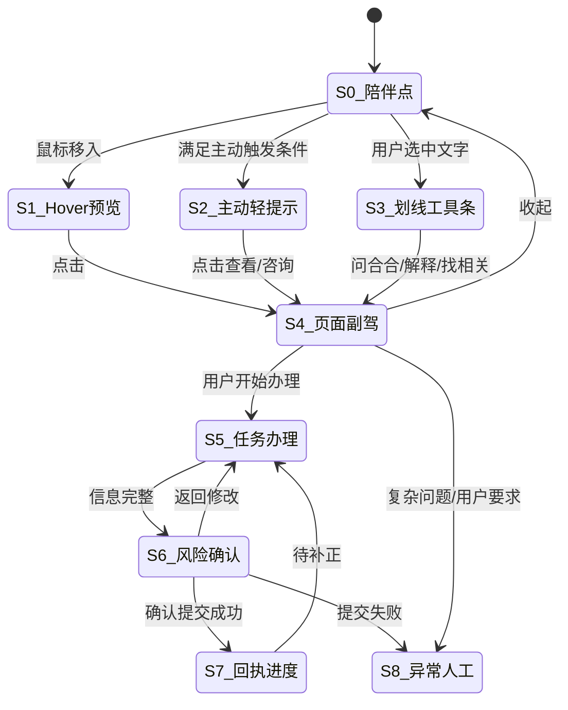
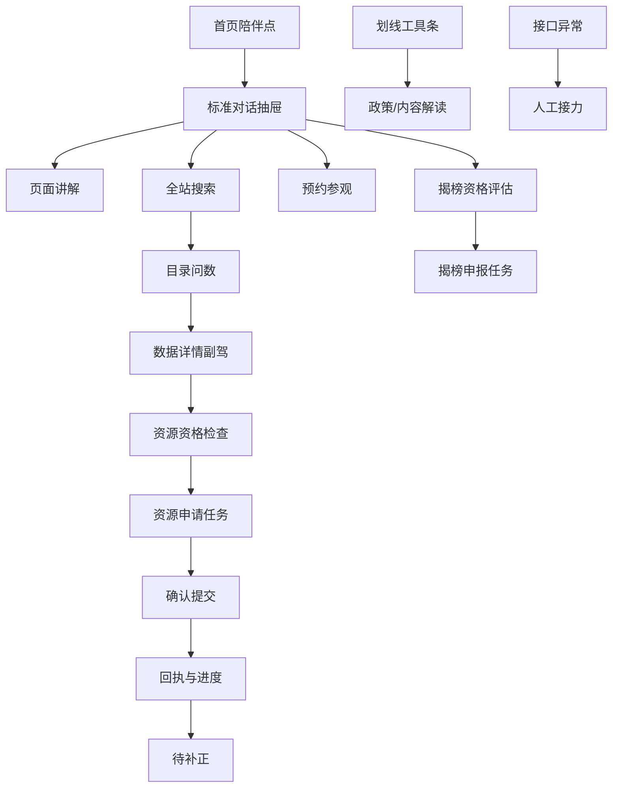

# 合合随行助手——高保真原型交互设计文档（v1.0）

> 项目：数智北京创新中心“合合”智能助手  
> 文档类型：独立产品原型交互设计规范  
> 核心约束：**只设计合合助手及其浮层交互，不改动数智北京创新中心网站的页面设计、信息架构、布局、配色和现有控件。**  
> 适用对象：产品经理、交互设计师、UI 设计师、Figma/Axure/HTML 原型设计人员、原型生成智能体、前端研发、业务接口方、测试人员  
> 依据资料：合合助手产品规划、数智创新服务平台项目申报书、场景创新与数据创新用户手册、平台入驻及资源申请说明、数智北京创新中心页面截图  
> 版本日期：2026-09-02

---

## 0. 文档结论

### 0.1 本原型只新增“一层合合助手”

所有高保真页面均采用以下结构：

```text
数智北京创新中心原页面（保持不变、锁定）
                ＋
合合助手交互浮层（本原型唯一设计对象）
```

不得进行以下操作：

- 不重做网站首页、顶部导航、栏目结构、卡片样式或列表样式；
- 不将白底目录页改造成深蓝数据大屏；
- 不调整网站已有按钮、筛选器、搜索框和内容排版；
- 不为展示合合而删除、挪动或重新包装网站内容；
- 不把合合设计成一个独立聊天网站；
- 不把每个页面都设计成完全不同的“AI 页面”；
- 不用虚构页面替代真实网站截图。

原型设计的重点是：

1. 合合如何常驻并随页面滚动保持可用；
2. 合合如何感知当前页面、栏目、对象、选中文字和用户身份；
3. 用户点击合合后，如何以抽屉、轻提示、划线工具条和任务工作台完成交互；
4. 合合如何主动讲解但不过度打扰；
5. 合合如何在同一个对话中完成“问答—搜索—问数—推荐—办理—跟踪”；
6. 合合如何通过边聊边办，将原本分散的表单和流程转化为可控的对话任务。

### 0.2 产品交互定位

> **合合是叠加在数智北京创新中心真实页面上的全站随行智能服务副驾。**

用户不必先理解网站导航和业务系统，只需要在任何页面表达问题或目标。合合根据当前上下文完成：

- **讲**：解释当前页面、栏目、字段、政策和办理规则；
- **找**：跨数据、需求、成果、服务、资讯等对象搜索；
- **查**：对目录数量、部门分布、分类和状态进行精确查询；
- **配**：根据身份、行业、项目目标推荐资源组合；
- **办**：通过对话完成预约、反馈、资源申请、揭榜、入驻等事项；
- **跟**：查询申请进度、补正材料、撤回和接收提醒；
- **联**：在复杂问题下转人工，并携带已整理的上下文。

### 0.3 高保真原型的核心验收标准

- 关闭合合助手后，原网站页面与截图完全一致；
- 合合固定于浏览器视口，不随正文坐标上下跳动；
- 标准问答使用窄抽屉，复杂办理使用宽任务抽屉；
- 合合主动提示只出现一句话，不自动弹出大抽屉；
- 每一次回答都明确显示“当前基于什么页面/对象回答”；
- 每一次正式提交都必须经过结构化确认；
- 目录数量必须以结构化查询结果展示，不以 RAG 猜测；
- 原型必须覆盖访客、个人用户、企业法人和项目负责人差异；
- 原型必须覆盖正常、无结果、权限不足、前置条件不满足、接口异常和转人工状态。

---

## 1. 原型设计范围

### 1.1 本期必须设计的能力

| 能力 | 原型表现 |
|---|---|
| 全站常驻 | 任意页面始终可看到合合陪伴点 |
| 页面跟随 | 滚动时陪伴点固定，当前上下文随页面变化 |
| 模块讲解 | Hover 或点击栏目后出现“合合可讲解” |
| 主动提示 | 停留、无结果、禁用操作、截止提醒时出现轻提示 |
| 划线提问 | 选择一段网页文字后出现微型工具条 |
| 页面副驾 | 点击合合后打开右侧对话抽屉 |
| 上下文可见 | 抽屉顶部显示当前页面、栏目、对象和身份 |
| 普通问答 | 平台、服务、政策、活动、成果、流程咨询 |
| 目录问数 | 精确回答“多少、哪些、按什么分组” |
| 个性化推荐 | 根据身份、企业和项目提供倾向性推荐 |
| 边聊边办 | 对话补全字段、校验、确认、提交、回执、进度 |
| 人工协同 | 复杂或异常问题携带上下文转人工 |

### 1.2 本期不作为原型重点

- 不设计网站运营后台；
- 不设计完整知识库管理后台；
- 不设计模型和 API 配置后台；
- 不设计审批人员的业务审核端；
- 不设计通用浏览器插件覆盖第三方网站；
- 不设计真实数据内容分析工作台；
- 不让合合自动点击网站按钮或代替用户绕过确认。

---

## 2. 原型图层与资产组织

### 2.1 Figma/Axure/HTML 图层结构

每个页面使用相同的图层命名和分层：

```text
00_Base_Website_Screenshot       原网站截图，锁定，不可编辑
10_Context_Hotspots              页面区块/对象热区，原型辅助层，默认透明
20_Hehe_Companion                合合陪伴点、在线状态、拖拽手柄
30_Hehe_Proactive_Prompt         主动轻提示与模块讲解锚点
40_Hehe_Selection_Toolbar        划线工具条
50_Hehe_Conversation_Drawer      标准对话抽屉
60_Hehe_Task_Drawer              宽任务抽屉/办理工作台
70_Hehe_Confirm_And_Receipt      确认、回执、进度、异常、转人工
80_Prototype_Annotations         页码、说明、热区标识，交付时可关闭
```

### 2.2 基础页面使用规则

- 优先使用用户提供的真实网站截图；
- 网站截图设置为锁定背景；
- 合合所有新 UI 均放在独立浮层中；
- 不直接在截图上重绘已有按钮；
- 需要展示页面响应时，只在原页面元素上增加透明交互热区；
- 所有网站数据均注明“页面现有值”或“原型示例值”；
- 页面截图出现赛事竖幅、返回顶部等悬浮元素时，合合必须避让。

---

## 3. 合合全局交互模型

### 3.1 核心状态

| 编号 | 状态 | 形态 | 主要用途 |
|---|---|---|---|
| S0 | 陪伴点 | 56–64px 吉祥物头像/上半身＋在线点 | 默认常驻入口 |
| S1 | Hover 预览 | 陪伴点旁显示一句能力说明 | 首次发现和快速唤起 |
| S2 | 主动轻提示 | 260–320px 一句话气泡＋单一 CTA | 停留、无结果、前置条件、提醒 |
| S3 | 划线工具条 | 选区附近 36–40px 高工具条 | 对网页文字即时提问 |
| S4 | 页面副驾抽屉 | 400–440px 右侧抽屉 | 问答、搜索、问数、推荐、进度 |
| S5 | 任务办理抽屉 | 720–860px 右侧宽抽屉 | 多步骤信息采集、材料和确认 |
| S6 | 风险确认层 | 抽屉内固定确认卡或居中轻遮罩 | 正式提交、撤回、删除等写操作 |
| S7 | 回执与进度态 | 回执卡＋时间线 | 提交成功、进度查询、待补正 |
| S8 | 异常/人工协同态 | 异常卡或人工接力卡 | 接口错误、复杂问题、人工兜底 |

### 3.2 状态转换



### 3.3 页面滚动行为

合合采用 `position: fixed` 的视口固定策略：

- 页面滚动时，陪伴点不随正文上下移动；
- 合合只更新“当前页面上下文”，不进行持续追逐动画；
- 滚动速度较快时暂停主动提示；
- 滚动停止 800ms 后重新计算当前关注区块；
- 抽屉打开时，网站仍可在抽屉外区域正常滚动；
- 标准问答抽屉不显示遮罩，方便用户边看原文边问；
- 正式确认或高风险操作可以增加 8%–16% 轻遮罩，但不修改原页面。

---

## 4. 位置、停靠和避让设计

### 4.1 默认位置

桌面端默认：

```text
视口右侧中下部
距右侧：24px
距底部：96px
陪伴点：64×64px
最小点击热区：44×44px
```

首页存在右侧赛事竖幅或其他悬浮广告时：

1. 优先移动至竖幅左侧；
2. 空间不足时吸附至视口左侧中下部；
3. 不遮挡首页“我要使用/我要提供/我要申请”主按钮；
4. 不遮挡返回顶部、客服、登录和页面主提交按钮。

### 4.2 拖拽与吸附

- 长按或按住拖拽手柄即可移动；
- 松开后自动吸附到最近的左/右边缘；
- 用户位置按设备保存；
- 页面切换时重新检查是否与避让区冲突；
- 拖动过程中不触发点击；
- 拖动结束后出现 1.5 秒“已固定在此处”提示；
- 提供“恢复默认位置”设置项。

### 4.3 抽屉展开方向

| 当前情况 | 抽屉方向 |
|---|---|
| 陪伴点在右侧 | 从右侧展开 |
| 陪伴点在左侧 | 从左侧展开 |
| 页面右侧有不可遮挡栏 | 从左侧展开 |
| 宽度小于 1024px | 底部 Sheet |
| 办理任务 | 右侧宽抽屉，必要时居中任务层 |

### 4.4 不改变网站布局的硬约束

本原型统一使用“覆盖式抽屉”，不推挤网站正文：

- 抽屉展开后覆盖页面右侧或左侧；
- 原页面宽度和内容位置不发生变化；
- 抽屉可切换为 80% 透明的“对照阅读模式”；
- 用户可随时收起抽屉查看被遮挡内容；
- 标准抽屉宽度不超过 440px；
- 复杂任务才进入宽抽屉。

---

## 5. 视觉样式规范

### 5.1 品牌与页面适配

合合需要保持统一品牌，不跟随每个栏目完全变色：

| 原页面类型 | 合合外壳 |
|---|---|
| 首页蓝色图片背景 | 深蓝半透明抽屉、白色文本、品牌红 CTA |
| 白底数据目录 | 白色抽屉、深蓝文本、淡灰边框、品牌红 CTA |
| 米白场景卡片 | 白色抽屉、低阴影、橙色仅作状态提示 |
| 绿色应用超市 | 白色抽屉，合合主按钮仍使用品牌红/深蓝 |
| 三维场景 | 深色半透明抽屉，降低背景干扰 |

### 5.2 原型暂定设计 Token

> 以下为高保真原型暂定值，正式上线前应以网站官方视觉规范校准。

```css
--hehe-navy: #0B2E59;
--hehe-blue: #1769D2;
--hehe-red: #E62E3A;
--hehe-orange: #F5A623;
--hehe-yellow: #FFC83D;
--hehe-surface: #FFFFFF;
--hehe-surface-soft: #F6F9FC;
--hehe-text: #1F2937;
--hehe-text-secondary: #667085;
--hehe-border: #DCE5F0;
--hehe-success: #16A36A;
--hehe-warning: #E99B22;
--hehe-danger: #D92D20;
```

### 5.3 吉祥物使用

- 使用现有黄色 3D 合合形象；
- 折叠态仅使用头像或上半身；
- 抽屉页头可使用 36–44px 头像；
- 单个界面只出现一个主吉祥物，避免重复堆叠；
- 动作按场景变化：欢迎、指引、思考、提醒、成功、异常、专业讲解；
- 政策、错误、隐私确认等场景避免跳跃庆祝动作；
- 吉祥物不得遮挡原网页内容。

### 5.4 圆角与阴影

- 陪伴点：圆形或软胶囊；
- 抽屉圆角：左上/左下 16px（右侧抽屉）；
- 卡片圆角：10–12px；
- 轻提示圆角：14px；
- 阴影克制，以区分层级为目的；
- 禁止满屏发光、霓虹连线和大面积玻璃拟态。

---

## 6. 合合陪伴点和轻交互组件

### 6.1 陪伴点组件

组成：

```text
[合合头像]
[在线状态点]
[未读数量，可选]
[拖拽手柄，仅 hover 显示]
```

状态：

- 默认：轻微呼吸动画，每 8–12 秒一次；
- Hover：外圈高亮，显示“问问合合”；
- 有主动提示：状态点变为提示色，头像轻点头一次；
- 有待办：右上显示 1–9 的红色数字角标；
- 离线/接口异常：状态点为灰色，点击后仍可查看帮助说明。

### 6.2 Hover 预览

鼠标停留陪伴点 300ms 后展示：

```text
你好，我是合合
我知道你当前在看「数据创新」
[问问当前页面]
```

规则：

- 只保留一个按钮；
- 鼠标移开 500ms 后收起；
- 不自动播放语音；
- 不覆盖页面主按钮。

### 6.3 模块讲解锚点

用户 Hover 页面一级区块 800ms 后，在模块边缘叠加一个小锚点：

```text
✨ 合合可讲解
```

点击后：

1. 将当前模块注册为上下文；
2. 打开对话抽屉；
3. 合合直接给出 2–3 句模块介绍；
4. 展示与该模块相关的 3 个快捷问题。

锚点是浮层，不改变模块尺寸和排版。

### 6.4 主动轻提示

组件结构：

```text
[合合小头像]  一句话说明
                为什么提示
                [主 CTA] [不再提示]
```

示例：

- “你正在浏览公共数据目录，需要我帮你按部门统计吗？”
- “该资源申请前需要先完成企业认证，我可以带你处理。”
- “这个场景还有 3 天截止，需要我评估你们的匹配度吗？”
- “没有找到完全匹配的资源，要不要帮你登记需求？”

主动提示不得直接打开大抽屉，必须由用户点击进入。

---

## 7. 划线提问交互

### 7.1 触发方式

用户在网页中选择 1–500 字文本，鼠标松开后，在选区上方出现：

```text
[问合合] [解释这段] [找相关] [去办理]
```

### 7.2 不同内容的默认动作

| 选中内容 | 默认主动作 |
|---|---|
| 数据集名称 | 解释数据＋查看获取方式 |
| 政策条款 | 解读条款＋查看来源 |
| 场景需求文字 | 分析需求＋评估匹配度 |
| 服务名称 | 解释服务＋查看申请条件 |
| 办理说明 | 提取材料＋开始办理 |
| 错误提示 | 分析原因＋给出处理路径 |
| 新闻标题 | 摘要内容＋显示发布时间 |

### 7.3 进入抽屉后的引用卡

```text
已引用当前页面内容
“药品批准信息（归集中）”
来源：数字资源 / 公共数据目录
[定位原文] [取消引用]
```

用户继续提问时，合合优先使用引用内容。用户说“这个”时，抽屉顶部显示当前指代对象。

### 7.4 边界处理

- 超过 500 字时提示“已截取前 500 字”；
- 跨多个区块时拆分为多段引用；
- 选中输入框、密码、手机号等敏感字段时不触发；
- 用户点击空白区后工具条消失；
- 划线内容只作为数据，不可改变系统指令；
- 表格、图片和图表本期不做任意框选，优先使用页面注册的结构化对象。

---

## 8. 页面副驾抽屉设计

### 8.1 尺寸

```text
标准宽度：420px
最小宽度：380px
最大宽度：440px
高度：100vh
层级：覆盖于原网站之上
默认：无全屏遮罩
```

### 8.2 抽屉结构

```text
┌────────────────────────────────┐
│ 合合助手  在线         ─  □  × │  页头
├────────────────────────────────┤
│ 当前页面：数字资源 / 数据目录   │
│ 当前对象：北京市教育委员会      │  上下文条
│ 当前身份：访客              切换│
├────────────────────────────────┤
│ 对话消息流                      │
│ · 合合回答                      │
│ · 来源卡                        │
│ · 问数卡                        │
│ · 推荐卡                        │
│ · 办理资格卡                    │
│ · 任务卡                        │
│ · 回执/进度卡                   │
├────────────────────────────────┤
│ 推荐问题 chips                  │
├────────────────────────────────┤
│ [输入你的问题…] [附件] [发送]    │
└────────────────────────────────┘
```

### 8.3 页头

必须包含：

- 合合头像与“合合助手”；
- 在线/思考中/查询中/办理中状态；
- 最小化；
- 对照阅读模式；
- 关闭；
- 可选的历史对话入口。

### 8.4 上下文条

最多显示三层：

```text
当前页面：数字资源 / 数据目录
当前范围：公共数据 / 部门
当前对象：北京市教育委员会
当前身份：访客
```

交互：

- 点击某一层可锁定；
- 点击“×”可移除当前对象；
- 页面滚动到新模块时，未锁定上下文自动更新；
- 上下文变化时只显示轻量过渡，不清空对话；
- 置信度不足时显示“确认当前对象”提示。

### 8.5 对话消息

- 用户消息靠右；
- 合合消息靠左；
- 普通解释不超过 5 行，详细内容折叠；
- 答案需要来源时在消息下方显示“来源依据”；
- 目录数据以结构化卡片展示；
- 办理信息不在自然语言中完整回显敏感字段；
- 每条答案支持“有帮助/没帮助”；
- 卡片操作数量不超过 3 个。

### 8.6 输入区

包含：

- 多行文本输入；
- 附件上传（仅在支持的任务中显示）；
- 发送按钮；
- 当前模式提示，例如“正在基于当前页面提问”；
- 可选快捷模式：问页面、找资源、查数据、办事项、查进度。

输入区不默认展示过多图标。语音输入不是本期高保真原型重点。

---

## 9. 任务办理抽屉设计

### 9.1 使用条件

以下情况从 420px 标准抽屉升级为 720–860px 任务抽屉：

- 字段超过 6 项；
- 需要多步骤；
- 需要材料上传；
- 需要展示资格和前置条件；
- 需要确认写入业务系统；
- 需要同时查看对话和结构化表单。

### 9.2 双栏结构

```text
┌─────────────────────────────── 任务抽屉 ───────────────────────────────┐
│ 事项名称   步骤 2/4   自动保存   暂停办理   ×                          │
├────────────────────────────┬──────────────────────────────────────────┤
│ 左：对话引导 40%           │ 右：结构化任务区 60%                    │
│ · 合合追问                  │ · 前置条件                              │
│ · 用户回答                  │ · 当前填写字段                          │
│ · 提示与解释                │ · 已收集信息                            │
│ · 相关规则                  │ · 附件与校验                            │
├────────────────────────────┴──────────────────────────────────────────┤
│ 上一步                      保存草稿                    下一步/确认    │
└──────────────────────────────────────────────────────────────────────┘
```

### 9.3 一次只问少量信息

- 每轮只突出 1–3 个字段；
- 合合先解释为什么需要这些字段；
- 已经从身份、企业或项目中读取的信息默认预填；
- 用户可以点击“修改”单独编辑；
- 不要求用户重复提供系统已有信息；
- 必填项、格式错误、业务规则错误需分别提示。

### 9.4 自动保存和恢复

- 每次字段改变后 800ms 自动保存草稿；
- 页头显示“已保存 14:32”；
- 用户关闭抽屉时提示“保留草稿/放弃”；
- 再次进入同一事项时恢复到上次步骤；
- 用户可以说“先到这里”，合合返回草稿编号和继续入口。

---

## 10. 主动解答与介绍规则

### 10.1 触发级别

| 级别 | 触发条件 | UI 表现 |
|---|---|---|
| L0 静默 | 快速滚动、普通浏览 | 仅陪伴点 |
| L1 可发现 | 首次 Hover 一级模块 | “合合可讲解”锚点 |
| L2 轻提示 | 停留 6 秒、重复浏览、无结果 | 一句话气泡 |
| L3 行动建议 | 禁用按钮、缺前置条件、即将截止 | 轻提示＋一个 CTA |
| L4 业务提醒 | 待补正、提交失败、重要到期 | 需用户处理的提醒卡，但不自动展开抽屉 |

### 10.2 关注区块推断

原型不表现“读心”，只表现可解释的上下文感知。优先级：

```text
用户划线/引用
> 当前点击对象
> 当前表单字段或错误
> 当前激活 Tab
> 视口中心区块
> 当前页面主对象
> 最近对话
> 用户画像
```

### 10.3 防打扰规则

- 用户正在输入时不提示；
- 用户快速滚动时不提示；
- 同一区块 24 小时最多主动提示一次；
- 用户关闭某类提示后，本次会话不再出现；
- 用户选择“不再提示”后进入偏好设置；
- 页面加载完成后不自动打开抽屉；
- 每条主动提示必须说明原因，例如“因为你已查看该资源 2 次”；
- 主动提示最多一个 CTA。

### 10.4 不同模块的主动介绍示例

| 页面/模块 | 主动提示文案 |
|---|---|
| 首页“我要使用” | “告诉我你的项目目标，我可以帮你组合数据、算力和组件。” |
| 首页“我要提供” | “准备发布数据、组件或服务？我可以帮你逐步整理材料。” |
| 首页“我要申请” | “这里可办理预约参观、需求反馈、揭榜、加入伙伴和入驻申请。” |
| 公共数据目录 | “需要我帮你按领域、数据主体或部门精确统计吗？” |
| 场景培育 | “我可以找出与你企业能力匹配、且即将截止的场景。” |
| 应用超市 | “我可以解释成果适用场景，并帮你联系提供方。” |
| 政策资讯 | “需要我总结这篇内容并判断是否与你当前项目有关吗？” |
| 申请页禁用按钮 | “当前缺少企业认证或项目团队，我可以告诉你最短完成路径。” |

---

## 11. 用户身份与个性化交互

### 11.1 身份层级

| 身份 | 合合默认提供 | 不允许或需引导 |
|---|---|---|
| 匿名访客 | 页面讲解、公开政策、公开目录问数、公开资源搜索、预约参观、需求反馈 | 不能查“我的”、不能正式申请受限资源 |
| 已登录个人 | 加入收藏/清单、历史会话、个人消息、企业认证办理 | 未获得企业身份前不能代表企业办理 |
| 待企业认证个人 | 认证进度、补充证明、撤回认证 | 其他企业事项仍受限 |
| 企业法人 | 企业画像、项目申请、揭榜、团队创建、入驻、伙伴申请 | 后续实施操作受项目状态约束 |
| 企业成员 | 与企业相关的公开/授权内容 | 是否可办理取决于被授予角色 |
| 项目负责人 | 项目资源、场地、人员、设备、进度、材料、验收/上架 | 只能操作授权项目 |
| 项目成员 | 查看和处理本人相关任务 | 不可执行法人或负责人专属操作 |

### 11.2 当前办事身份显示

抽屉上下文条必须显示：

```text
当前身份：合合科技有限公司 · 企业法人
当前项目：城市交通客流预测项目
[切换身份] [切换项目]
```

同一用户存在多个组织或项目时，正式写操作前必须重新确认当前身份。

### 11.3 个性化首页开场

#### 匿名访客

```text
你好，我是合合。
我可以介绍平台、帮你找公开资源、解读政策，也可以直接办理预约参观和需求反馈。
```

快捷问题：了解平台、找数据、看场景、预约参观。

#### 已登录个人

```text
欢迎回来。你上次关注了 3 个数据资源，企业认证仍在审核中。
```

快捷问题：继续上次对话、查看收藏、查认证进度、找公开资源。

#### 企业法人

```text
欢迎回来。你当前有 1 个项目待创建团队，2 个事项需要补充材料。
```

快捷问题：项目待办、创建团队、申请资源、查看政策支持。

#### 项目负责人

```text
当前项目已完成立项，可继续申请资源与场地。人员进场需等待场地审核通过。
```

快捷问题：项目流程、申请资源、场地申请、查办理进度。

### 11.4 记忆使用边界

- 可记忆：用户偏好、关注领域、收藏、历史对话摘要、用户主动确认的长期目标；
- 实时查询：身份、企业、项目、权限、审批状态、待办和资源可用性；
- 不可从记忆推断：法人资格、项目授权、审批结论、政策有效性；
- 用户可查看“合合记住了什么”并删除；
- 访客不建立跨会话个人记忆。

---

## 12. 全站页面中的合合交互矩阵

### 12.1 首页

| 页面位置 | 合合感知 | 快捷问题 | 可执行动作 |
|---|---|---|---|
| 顶部全站检索 | 当前搜索词和类型 | “帮我找交通相关资源” | 打开聚合搜索结果 |
| 我要使用 | 云网算、组件、共性服务、数据、技术能力 | “我适合用什么？” | 生成资源组合方案 |
| 我要提供 | 数据、组件、场景、应用、服务 | “我想提供一个组件” | 启动发布向导 |
| 我要申请 | 预约、反馈、揭榜、伙伴、入驻 | “我能办什么？” | 身份检查并开始办理 |
| 数据创新 | 目录、入驻项目、外链 | “市教委有多少数据？” | 目录问数、项目匹配 |
| 场景培育 | 揭榜中、对接中、已完成 | “哪些场景适合我们？” | 匹配、提醒、揭榜 |
| 应用超市 | 应用创新/数据创新成果 | “这个成果能做什么？” | 查看、对接、收藏 |
| 新闻活动 | 新闻、通知、政策、赛事、活动 | “总结并告诉我是否相关” | 订阅、报名、查看原文 |

### 12.2 创新服务

合合提供：

- 解释数据创新、场景培育、评测验证、生态孵化和展示推广；
- 通过 3–5 个问题判断用户更适合哪类服务；
- 展示申请条件、材料、周期和下一步；
- 评测验证场景中区分大模型测评与感知算法测评；
- 可以从咨询转申请。

### 12.3 创新成果

合合提供：

- 一句话概括成果；
- 判断适用行业、部署方式和成熟度；
- 查找与当前场景相似的成果；
- 推荐可联系的提供单位；
- 发起成果咨询或需求对接；
- 区分应用创新成果和数据创新成果。

### 12.4 数字资源

合合提供：

- 云网算规格解释和适配建议；
- 组件版本、架构、调用方式和兼容性说明；
- 共性服务功能讲解；
- 数据目录问数、筛选和推荐；
- 技术能力多选并形成需求清单；
- 资源申请资格和前置条件检查。

### 12.5 我要提供

合合提供：

- 识别数据、组件、场景、应用、服务或其他；
- 根据供给类型使用不同字段模板；
- 从企业资料中预填通用信息；
- 辅助编写介绍，但不编造资质和案例；
- 检查分类、版本、架构、权属、许可和质量材料；
- 提交前生成发布预览与确认卡。

### 12.6 我要申请

合合提供：

- 预约参观；
- 需求反馈；
- 我要揭榜；
- 加入伙伴；
- 申请入驻；
- 登录与身份判断；
- 进度查询和补正提醒。

### 12.7 政策解读/新闻资讯

合合提供：

- 核心结论；
- 发布单位和时间；
- 适用对象；
- 与当前用户/企业/项目的关联；
- 原文依据；
- 相关服务和办理入口；
- 时效提示和版本说明。

### 12.8 关于我们/走进创新中心

合合提供：

- 平台定位、架构和业务讲解；
- 参观路线和区域介绍；
- 外景、南区办公区、北区展厅讲解；
- 联系方式与常见问题；
- 直接转预约参观。

---

## 13. 普通问答原型设计

### 13.1 页面讲解

用户：

> “这一块是做什么的？”

抽屉回答结构：

```text
当前基于：主页 / 数据创新

数据创新区主要包括：
1. 数据资源目录：查找公共、企业和专题数据；
2. 入驻项目：了解正在平台开展的数据创新项目；
3. 外部链接：进入相关数据开放或活动平台。

[查看数据目录] [找相似项目] [登记数据需求]
```

### 13.2 政策咨询

用户：

> “公共数据可以用于商业产品吗？”

回答卡结构：

- 核心结论；
- 适用对象；
- 限制条件；
- 申请或合规建议；
- 来源依据；
- 更新时间；
- “查看原文/找相关数据/开始申请”。

没有足够依据时，必须回答“当前资料不能直接支持该结论”，不得自行给出确定性政策结论。

### 13.3 服务咨询

用户：

> “我们要验证一个政务大模型，平台能提供什么？”

合合先追问：

- 当前处于研发、测试还是上线阶段；
- 是否已有测试集；
- 需要效果、合规、安全还是性能评测；
- 是否需要可信环境。

然后返回：服务建议、材料清单、周期、可用资源、下一步申请。

### 13.4 新闻与活动

回答必须区分：

- 新闻报道；
- 政策解读；
- 通知/公示；
- 赛事；
- 活动预告；
- 典型案例。

卡片显示发布时间，过期活动不得显示为“可报名”。

---

## 14. 目录问数原型设计

### 14.1 为什么单独设计

“某委办局有多少数据集”“列出全部”“按领域统计”等问题要求精确数量、完整列表和聚合分布，不能依赖文档 RAG 随机召回。

### 14.2 支持问法

- 市教委有多少数据集？
- 市交通委的数据按领域怎么分？
- 法人类数据资源有哪些？
- 哪些高质量数据集适合人工智能训练？
- 空间图实验室和信令实验室分别有多少数据？
- 只看开放、最近更新的数据。

### 14.3 问数结果卡

```text
查询范围
公共数据 / 部门 / 北京市教育委员会

数据集总数：实时接口值
分类分布：教育管理、教育统计……
开放状态：开放 / 有条件开放 / 其他
最近更新时间：接口值

预览列表（前 10 条）
[数据集名称] [领域] [更新时间] [获取方式]

[继续筛选] [查看全部] [导出清单] [登录后加入方案]
```

### 14.4 多轮继承

```text
用户：市教委有哪些数据？
合合：返回总数与前 10 条。
用户：只看法人类。
合合：继承“市教委”，增加“数据主体=法人类”。
用户：最近三个月更新的。
合合：继续继承部门和数据主体，增加更新时间。
```

抽屉顶部必须展示当前筛选条件，允许逐项删除。

### 14.5 异常

| 状态 | 表现 |
|---|---|
| 无结果 | 推荐放宽条件、相关资源、需求反馈 |
| 查询超时 | 显示重试和保留查询条件 |
| 权限不足 | 显示可见范围和登录/认证入口 |
| 数据更新中 | 标注更新时间，不使用旧缓存冒充实时 |
| 结果过多 | 显示分布与前 10 条，不在对话中输出数百条 |

---

## 15. 边聊边办总体交互

### 15.1 通用流程


### 15.2 对话和卡片分工

- 对话：理解目标、解释规则、追问和协商；
- 资格卡：显示登录、身份和前置条件；
- 表单卡：采集结构化字段；
- 材料卡：上传、分类和校验附件；
- 确认卡：展示正式写入内容；
- 回执卡：展示业务单号和时间；
- 进度卡：展示节点、待补正和操作；
- 人工接力卡：异常和复杂问题转人工。

### 15.3 办理事项清单

#### 低风险、适合首批原型

- 预约参观；
- 需求反馈；
- 查询申请进度；
- 加入资源清单；
- 保存草稿；
- 订阅提醒。

#### 企业与项目办理

- 个人申请企业认证；
- 场景创新项目申报；
- 路演回执；
- 揭榜确认；
- 创建和变更项目团队；
- 数据、组件、云网算和模型资源申请；
- 场地/工位申请；
- 人员进场；
- 设备进场；
- 技术能力需求登记；
- 加入伙伴；
- 申请入驻。

#### 项目实施后续

- 政务外网动态码登录引导；
- 开发过程和材料上报；
- 可信空间开发入口；
- 场景验收；
- 示范推广；
- 产品上架；
- 第三方质量测试；
- 专家评审。

---

## 16. 边聊边办详细场景一：预约参观

### 16.1 触发

- 首页“我要申请”；
- 关于我们；
- 走进创新中心三维场景；
- 用户直接说“我想预约参观”。

### 16.2 身份

访客即可发起。未登录时说明本次收集的信息仅用于预约。

### 16.3 对话流程

```text
用户：我想周五带 8 个人来参观。
合合：好的，我先确认可预约时段。请问是企业团队、高校团队还是个人参观？
用户：企业团队。
合合：周五有 10:00–11:30 和 14:00–15:30 两个时段，你希望选择哪个？
```

### 16.4 任务抽屉字段

- 团队/个人类型；
- 日期；
- 时段；
- 人数；
- 单位名称；
- 联系人；
- 联系电话；
- 来访目的；
- 是否需要重点讲解区域；
- 隐私和入场提醒确认。

### 16.5 确认卡

```text
预约事项：创新中心参观
参观单位：XX 科技有限公司
人数：8 人
时间：2026-09-04 14:00–15:30
联系人：王**
联系电话：138****6688
讲解需求：数据创新与可信空间

[返回修改] [确认预约]
```

### 16.6 回执

- 预约编号；
- 时间和地点；
- 入场证件提醒；
- 联系方式；
- 查看进度；
- 修改/取消；
- 加入日历或订阅提醒。

### 16.7 异常

- 时段已满：推荐相邻时段；
- 人数超限：建议拆分或转人工；
- 接口失败：草稿保留，提供重试；
- 临近预约时间：提示人工确认。

---

## 17. 边聊边办详细场景二：资源申请

### 17.1 触发

- 数字资源列表/详情；
- 用户说“我要申请这个数据集”；
- 用户说“我要申请两台 GPU 服务器”；
- 资源方案中的批量申请。

### 17.2 资格门禁卡

标准抽屉先显示：

```text
申请资格检查
当前身份：XX 企业 · 项目成员
当前项目：交通客流预测项目

✓ 已登录
✓ 已完成企业认证
✓ 项目已立项
✕ 尚未创建项目团队

完成团队创建后才可正式申请资源。
[查看原因] [去创建团队]
```

### 17.3 资源申请字段

通用字段：

- 当前项目；
- 申请人；
- 资源名称/类型；
- 使用目标；
- 申请理由；
- 申请依据；
- 使用时间；
- 联系方式；
- 附件。

云网算字段：

- 服务器/算力类型；
- 数量；
- CPU、内存、磁盘；
- GPU 型号和显存；
- 操作系统；
- 网络和存储需求；
- 使用期限。

数据资源字段：

- 数据用途；
- 使用范围；
- 获取方式；
- 安全承诺；
- 是否涉及个人信息/敏感数据；
- 输出和导出需求。

### 17.4 对话策略

- 已有项目、企业和联系人信息自动预填；
- 资源详情自动带入，不让用户重复选择；
- 规格问题使用选项卡，不要求全部自由文本；
- 用户说“和上次一样”时，展示历史配置供确认，不直接套用；
- 申请多个资源时，通用字段统一填写，差异字段分资源补充。

### 17.5 正式确认

确认卡必须显示：

- 申请身份；
- 项目；
- 资源清单；
- 规格；
- 使用期限；
- 关键承诺；
- 附件；
- 将写入的业务系统；
- 是否可以撤回。

### 17.6 回执与进度

状态示例：

```text
草稿 → 已提交 → 审批中 → 待实施 → 实施完成
```

进度卡支持：

- 查看审批详情；
- 查看审批记录；
- 撤回并填写原因；
- 待补正时继续补充；
- 审批完成后评价。

---

## 18. 边聊边办详细场景三：场景揭榜

### 18.1 触发

- 场景培育“揭榜中”列表；
- 场景详情；
- 用户说“我们能不能报名这个场景”。

### 18.2 合合先做的事

1. 解读场景目标和关键要求；
2. 检查企业法人身份；
3. 读取企业行业、产品、资质和历史项目；
4. 给出匹配度与风险；
5. 明确不能自动编造的内容。

### 18.3 资格与匹配卡

```text
场景匹配评估
匹配度：82%（原型示例）

优势：
✓ 有交通数据分析项目经验
✓ 具备时空模型研发团队

待补充：
! 缺少同类场景验收证明
! 项目负责人尚未确认

[查看需求解读] [开始准备申报]
```

### 18.4 申报步骤

```text
企业基本信息
→ 企业资质
→ 产品与服务
→ 研发人员
→ 实施方案
→ 技术方案
→ 创新点
→ 附件
→ 完整度检查
→ 确认申报
```

### 18.5 AI 辅助边界

合合可以：

- 提炼场景要求；
- 给方案目录；
- 根据用户输入组织语言；
- 检查是否遗漏；
- 识别材料冲突；
- 生成路演准备清单。

合合不得：

- 编造资质；
- 编造项目案例；
- 编造团队成员；
- 替企业承诺无法核实的指标；
- 自动点击“确认申报”。

### 18.6 后续对话

申报后，合合继续支持：

- 路演通知；
- 路演回执；
- 查看排期；
- 中榜后的揭榜确认；
- 创建项目团队；
- 进入后续实施流程。

---

## 19. 边聊边办详细场景四：场地、人员和设备链式办理

### 19.1 业务依赖

```text
场地/工位申请审核通过
           ↓
人员进场与设备进场才可申请
           ↓
审核通过后线下办理入场
           ↓
现场开通门禁和政务外网
```

### 19.2 助手页面表现

当用户在项目工作台问“为什么人员进场按钮点不了”时：

```text
当前不能申请人员进场
原因：场地申请仍在审核中。

场地申请状态：审批中
提交时间：2026-09-01 14:32
预计下一节点：运营人员分配工位

[查看场地申请] [订阅状态提醒]
```

### 19.3 场地申请字段

- 业务类型；
- 项目；
- 计划起止时间；
- 工位数量；
- 特殊空间需求；
- 联系人；
- 说明。

### 19.4 人员进场字段

- 已审批通过的场地；
- 计划进场起止时间；
- 进场人员；
- 人员身份和联系方式；
- 是否需要门禁；
- 注意事项确认。

### 19.5 设备进场字段

- 已审批场地；
- 计划进离场时间；
- 设备名称、类型、数量；
- 设备编号；
- 是否使用机房空间；
- 是否使用政务外网或带宽；
- 安全说明。

### 19.6 政务外网提示

审核通过后，合合只做引导：

- 到现场开通门禁；
- 向现场项目经理申请政务外网；
- 使用京通小程序动态验证码登录工作空间；
- 不在互联网端伪装已进入可信空间。

---

## 20. 边聊边办详细场景五：进度、补正与撤回

### 20.1 查询方式

用户可说：

- “我的资源申请到哪了？”
- “有哪些事项待补正？”
- “帮我撤回刚提交的申请。”
- “场景揭榜什么时候有结果？”

### 20.2 进度卡

```text
云网算资源申请
单号：YS202609020001
状态：审批中

申请提交  ✓
形式审查  进行中
业务审核  等待中
办结      等待中

当前说明：材料正在进行形式审查。
[查看详情] [撤回申请] [订阅提醒]
```

### 20.3 待补正

待补正卡必须显示：

- 缺失或错误内容；
- 退回意见；
- 截止时间；
- 原材料和新材料；
- “继续补正”；
- 重新提交前再次确认。

### 20.4 撤回

撤回属于高风险写操作：

1. 合合说明影响；
2. 收集撤回原因；
3. 显示可否恢复；
4. 用户二次确认；
5. 返回撤回结果和时间。

---

## 21. 异常、权限和人工协同

### 21.1 未登录

```text
该操作需要登录后完成。
登录后可复用企业和项目资料，并持续查询办理进度。
[去登录] [先了解办理条件]
```

### 21.2 未完成企业认证

```text
你当前以个人身份登录，尚不能代表企业提交该申请。
最短路径：申请企业认证 → 法人审核 → 重新进入本事项。
[申请企业认证] [查看认证进度]
```

### 21.3 前置条件不满足

使用资格门禁卡，不只显示“无权限”：

- 当前身份；
- 已满足项；
- 未满足项；
- 原因；
- 最短完成路径；
- 去完成前置事项。

### 21.4 接口超时

```text
提交暂未完成，系统返回超时。
你的草稿和附件已保存，本次不会重复提交。
[重新查询结果] [稍后提醒我] [转人工]
```

### 21.5 外部链接

当用户进入不受平台控制的外部页面：

```text
当前已离开数智北京创新中心受控页面。
合合无法继续读取该页面内容，但仍可保留此前对话并提供通用咨询。
```

### 21.6 人工接力卡

必须包含：

- 为什么建议转人工；
- 已整理的问题摘要；
- 当前页面和业务对象；
- 用户同意共享的材料；
- 预计响应时间；
- 接力编号；
- 人工服务入口；
- 隐私说明。

---

## 22. 高保真原型页面清单

> 每一页均使用真实网站截图作为锁定背景，只新增合合浮层。建议先设计桌面 1920×1080，随后补 1440×900 和移动端关键状态。

### A. 全局随行状态

| 编号 | 原型名称 | 基础网站页面 | 合合状态 | 关键交互 | 下一页 |
|---|---|---|---|---|---|
| H01 | 首页陪伴点默认态 | 首页首屏 | S0 | 点击、Hover、拖拽、吸附、避让赛事竖幅 | H02/H03 |
| H02 | 陪伴点 Hover 预览 | 首页首屏 | S1 | 显示当前页面和“问问合合” | H05 |
| H03 | “我要使用”模块主动轻提示 | 首页相应区块 | S2 | 停留后提示资源组合，不自动展开 | H05 |
| H04 | 模块“合合可讲解”锚点 | 数据创新区块 | S1 | 点击锚点，锁定模块上下文 | H05 |
| H05 | 标准对话抽屉初始态 | 首页 | S4 | 上下文条、推荐问题、访客能力 | Q01 |
| H06 | 页面滚动上下文切换 | 首页数据创新→场景培育 | S4 | 上下文条自动更新，支持锁定/取消 | Q01/Q03 |
| H07 | 划线工具条 | 数据/政策/新闻标题 | S3 | 问合合、解释、找相关、去办理 | Q02/Q04 |

### B. 身份与个性化

| 编号 | 原型名称 | 基础网站页面 | 身份 | 合合表现 |
|---|---|---|---|---|
| U01 | 匿名访客欢迎 | 首页 | 访客 | 平台讲解、公开搜索、预约、反馈 |
| U02 | 已登录个人欢迎 | 首页/个人中心 | 个人 | 收藏、历史、认证进度、继续上次对话 |
| U03 | 企业法人欢迎 | 首页/个人中心 | 法人 | 项目待办、揭榜、团队创建、入驻 |
| U04 | 项目负责人欢迎 | 项目详情 | 项目负责人 | 当前项目流程、资源、场地和待补正 |
| U05 | 身份/项目切换 | 任意受控页 | 多身份 | 切换后重新确认上下文和权限 |

### C. 普通问答、搜索和问数

| 编号 | 原型名称 | 基础网站页面 | 合合组件 | 关键结果 |
|---|---|---|---|---|
| Q01 | 当前模块讲解 | 首页数据创新 | KnowledgeAnswerCard | 模块介绍＋入口 |
| Q02 | 政策划线解读 | 政策/资讯详情 | 引用卡＋来源卡 | 结论、适用对象、来源、办理建议 |
| Q03 | 全站资源搜索 | 首页搜索/任意页 | 聚合搜索卡 | 数据、需求、成果、服务分类结果 |
| Q04 | 市教委数据目录问数 | 公共数据目录部门页 | CatalogQueryCard | 精确总数、分布、前 10 条 |
| Q05 | 多轮筛选问数 | 同上 | 条件条＋列表 | 继承部门，增加主体和时间 |
| Q06 | 数据详情副驾 | 数据集详情 | 对象解读卡 | 字段、更新、适用场景、获取方式 |
| Q07 | 搜索无结果转需求 | 任意搜索页 | EmptyResultCard | 相关内容＋需求反馈 |

### D. 边聊边办

| 编号 | 原型名称 | 基础网站页面 | 合合状态 | 关键组件 |
|---|---|---|---|---|
| B01 | 预约参观开始 | 首页/关于我们 | S4→S5 | 事项识别、时段查询 |
| B02 | 预约参观信息补全 | 同上 | S5 | 对话＋表单卡 |
| B03 | 预约确认和回执 | 同上 | S6→S7 | 确认卡、预约编号 |
| B04 | 资源申请资格检查 | 资源详情 | S4 | EligibilityGateCard |
| B05 | GPU 资源信息采集 | 资源详情 | S5 | 双栏任务、规格卡、草稿 |
| B06 | 多资源批量申请 | 资源清单 | S5 | 通用字段＋差异字段 |
| B07 | 资源申请确认 | 任务抽屉 | S6 | 身份、项目、资源、承诺、附件 |
| B08 | 资源回执与进度 | 个人中心/任意页 | S7 | 单号、时间线、订阅 |
| B09 | 待补正继续办理 | 个人中心 | S7→S5 | 退回意见、附件替换、重新确认 |
| B10 | 场景揭榜资格评估 | 场景详情 | S4 | 匹配度、风险、开始申报 |
| B11 | 揭榜申报任务工作台 | 场景详情 | S5 | 企业/方案/团队/附件 |
| B12 | 场地前置条件解释 | 项目工作台 | S4 | 灰色按钮原因、最短路径 |
| B13 | 人员/设备链式申请 | 项目工作台 | S5 | 场地选择、人员或设备字段 |
| B14 | 接口异常与恢复 | 任意办理页 | S8 | 草稿保护、重试、人工 |
| B15 | 人工专家接力 | 任意复杂场景 | S8 | HandoffCard |

### E. 移动端

| 编号 | 原型名称 | 基础网站页面 | 形态 |
|---|---|---|---|
| M01 | 移动端陪伴点 | 移动首页 | 52px 底部浮点 |
| M02 | 移动端问答 Bottom Sheet | 移动目录/详情 | 88% 高 Bottom Sheet |
| M03 | 移动端办理卡 | 移动申请 | 全屏任务态，底部固定操作 |
| M04 | 移动端消息和待补正 | 个人中心 | 提醒卡＋继续办理 |

---

## 23. 重点原型页面详细生成契约

### 23.1 H01 首页陪伴点默认态

```yaml
page_id: H01
base_page: 数智北京创新中心首页真实截图
website_changes: none
user: anonymous
assistant_state: collapsed
assistant_position: 动态避让赛事竖幅，优先右侧中下
must_show:
  - 合合头像/上半身
  - 在线状态点
  - Hover 外圈
interactions:
  - click: 打开 H05
  - hover: 打开 H02
  - drag: 左右边缘吸附
  - scroll: 固定视口，不移动
forbidden:
  - 重做首页
  - 遮挡主搜索框
  - 遮挡我要使用/提供/申请
```

### 23.2 H07 划线提问

```yaml
page_id: H07
base_page: 数据目录、政策或新闻真实页面
website_changes: none
trigger: 用户选中一段文字
assistant_state: selection_toolbar
selection_toolbar:
  actions: [问合合, 解释这段, 找相关, 去办理]
next_state: conversation_drawer
must_show_in_drawer:
  - 引用原文卡
  - 页面与栏目来源
  - 定位原文
  - 取消引用
```

### 23.3 Q04 目录问数

```yaml
page_id: Q04
base_page: 公共数据目录-部门页真实截图
website_changes: none
user: anonymous
context:
  page: 数字资源/数据目录
  tab: 公共数据/部门
  entity: 北京市教育委员会
trigger: 用户问“市教委有哪些数据集？”
assistant_state: expanded_drawer
components:
  - ContextBar
  - CatalogQueryCard
  - DatasetPreviewList
  - SourceAndUpdatedAt
operations:
  - 继续筛选
  - 查看全部
  - 导出清单
  - 登录后加入方案
errors:
  - no_result
  - timeout
  - unauthorized
```

### 23.4 B05 GPU 资源申请

```yaml
page_id: B05
base_page: 云网算资源详情或项目资源目录
website_changes: none
user: enterprise_project_lead
assistant_state: task_drawer
layout: 双栏，左对话右结构化任务
steps:
  - 资格检查
  - 选择项目
  - 资源规格
  - 使用说明与期限
  - 附件与承诺
  - 确认提交
must_show:
  - 自动预填来源
  - 字段校验
  - 自动保存时间
  - 已收集信息概览
  - 暂停办理
  - 返回修改
  - 确认提交
forbidden:
  - 未确认直接提交
  - 用聊天文本完整显示敏感信息
```

### 23.5 B10 场景揭榜资格评估

```yaml
page_id: B10
base_page: 场景详情真实截图
website_changes: none
user: enterprise_legal_person
assistant_state: expanded_drawer
components:
  - 场景需求解读
  - 企业匹配评估
  - 已满足条件
  - 待补充材料
  - 风险提示
  - 开始准备申报
must_not:
  - 编造资质
  - 编造案例
  - 承诺中榜
```

---

## 24. 合合 UI 组件清单

### 24.1 基础组件

- `HeheCompanionFab`：陪伴点；
- `HeheHoverPreview`：Hover 预览；
- `HeheProactiveBubble`：主动轻提示；
- `HeheSectionAnchor`：模块讲解锚点；
- `HeheSelectionToolbar`：划线工具条；
- `HeheDrawerHeader`：抽屉页头；
- `HeheContextBar`：页面、对象和身份上下文；
- `HeheMessageList`：对话消息流；
- `HeheComposer`：输入区；
- `HeheSuggestedQuestions`：推荐问题。

### 24.2 回答组件

- `KnowledgeAnswerCard`：知识/政策回答；
- `SourceReferenceCard`：来源和更新时间；
- `SearchAggregateCard`：跨对象搜索；
- `CatalogQueryCard`：精确问数；
- `EntityPreviewList`：数据/成果/场景预览；
- `RecommendationBundleCard`：个性化组合包；
- `ComparisonCard`：资源或成果对比。

### 24.3 办理组件

- `EligibilityGateCard`：资格门禁；
- `TaskStepHeader`：步骤与进度；
- `TaskFormCard`：结构化字段；
- `AttachmentCard`：材料上传与校验；
- `CollectedInfoSummary`：已收集信息；
- `ConfirmCard`：正式确认；
- `ReceiptCard`：回执；
- `ProgressTimelineCard`：进度；
- `CorrectionCard`：待补正；
- `HandoffCard`：人工接力；
- `ExceptionCard`：异常恢复。

### 24.4 每个组件需要的交互状态

```text
Default / Hover / Active / Focus / Loading / Success / Warning / Error / Disabled
```

不能只画默认态。

---

## 25. 动效规范

| 场景 | 动效 |
|---|---|
| 陪伴点呼吸 | 1.02 倍缩放，600ms，每 8–12 秒一次 |
| 抽屉打开 | 180–220ms，从停靠边缘平移进入 |
| 抽屉收起 | 160–200ms |
| 上下文切换 | 120ms 淡入，禁止整抽屉闪烁 |
| 主动轻提示 | 150ms 淡入＋4–6 秒后收起 |
| 查询中 | 状态文字＋简洁加载点，不使用大面积骨架屏 |
| 提交成功 | 回执卡出现，可配合一次轻微点头/成功动作 |
| 异常 | 不抖动，不使用强烈红色闪烁 |

遵守 `prefers-reduced-motion`，用户减少动态效果时关闭呼吸和位移动画。

---

## 26. 文案规范

### 26.1 语气

- 专业、准确、友好；
- 不卖萌过度；
- 不使用“我什么都能做”；
- 不对审批结果做承诺；
- 不把推测写成事实；
- 错误时先说明现状，再给解决路径。

### 26.2 主动提示公式

```text
为什么现在提示 + 能帮什么 + 一个动作
```

示例：

> “你正在查看市教委数据目录，我可以直接帮你统计数量和分类。［开始查询］”

### 26.3 资格不足公式

```text
当前不能做什么 + 原因 + 最短路径 + 去处理
```

示例：

> “当前不能提交资源申请，因为项目团队尚未创建。完成团队创建后即可继续。［去创建团队］”

### 26.4 提交确认公式

```text
将以什么身份 + 向哪个系统 + 提交什么 + 风险/撤回说明
```

---

## 27. 响应式设计

### 27.1 桌面端

- 1920×1080 为主设计画布；
- 1440×900 验证不遮挡；
- 标准抽屉 420px；
- 任务抽屉 760px；
- 低于 1280px 时任务抽屉可占 78vw。

### 27.2 平板

- 标准问答使用 440–520px 覆盖式抽屉；
- 任务态使用 86vw；
- 陪伴点优先吸附右下。

### 27.3 移动端

- 陪伴点 52px；
- 标准问答为 Bottom Sheet，高度 72%–88%；
- 多步骤办理使用全屏；
- 上下文条最多显示两层；
- 底部固定“上一步/下一步/确认”；
- 划线工具条简化为“问合合/解释”。

---

## 28. 可访问性和可用性

- 所有图标配文字或无障碍标签；
- 键盘可 Tab 到陪伴点、抽屉和工具条；
- Esc 收起当前浮层但不丢失草稿；
- 焦点进入抽屉后保持合理焦点顺序；
- 对比度不低于 4.5:1；
- 陪伴点点击区不小于 44px；
- 表单错误在字段旁和对话中同时说明；
- 颜色不是唯一状态表达；
- 用户可关闭主动提示和动画。

---

## 29. 高保真原型交付物

### 29.1 必交文件

1. Figma 或 Axure 主原型；
2. 桌面端 H01–B15 核心状态；
3. 移动端 M01–M04；
4. 合合组件库；
5. 交互连线；
6. 页面状态说明；
7. 标准文案清单；
8. 异常和权限矩阵；
9. 可点击 HTML 演示版（可选但建议）。

### 29.2 页面命名

```text
H01-首页-陪伴点
H02-首页-Hover预览
H03-首页-主动提示
H07-目录-划线提问
Q04-公共数据-部门问数
B05-云网算-资源申请
B08-资源申请-回执进度
B10-场景详情-揭榜评估
```

### 29.3 原型连线主链路



---

## 30. 原型生成智能体总提示词

```text
你正在设计“数智北京创新中心—合合随行助手”的高保真 Web 交互原型。

本次只允许设计合合助手浮层，不允许改动参考截图中的网站设计。

一、基础网站
1. 把用户提供的网站截图作为锁定背景。
2. 不重做顶部导航、搜索框、栏目、列表、卡片、主色和页面排版。
3. 不移动、删除或重新包装网站已有内容。
4. 只通过透明热区模拟网站原控件点击。

二、合合助手
1. 使用现有黄色 3D 合合吉祥物，保持帽子、胸前标识、绿色腰部结构和蓝绿色鞋。
2. 默认以 56–64px 陪伴点固定在浏览器视口边缘，并避让赛事竖幅、返回顶部和主按钮。
3. 页面滚动时助手位置稳定，只更新当前上下文。
4. 支持：陪伴点、Hover 预览、主动轻提示、模块讲解锚点、划线工具条、标准对话抽屉、宽任务抽屉、确认、回执、异常和人工接力。
5. 普通问答抽屉宽 420px，无全屏遮罩；复杂办理任务抽屉宽约 760px。
6. 抽屉顶部必须显示当前页面、栏目、对象、身份和项目。

三、交互原则
1. 主动提示不能自动打开大抽屉，只展示一句话和一个 CTA。
2. 用户选中文字后，在选区附近显示“问合合 / 解释这段 / 找相关 / 去办理”。
3. 对话负责理解，结构化卡片负责填写、校验和提交。
4. 目录数量必须用精确问数卡展示，不要用普通聊天气泡猜测。
5. 未登录、未认证或前置条件不满足时，必须显示原因和最短完成路径。
6. 正式写操作必须先显示确认卡；成功后显示业务单号和进度。
7. 接口失败时保留草稿，支持重试和转人工。

四、视觉
1. 合合面板根据原页面采用深色或浅色外壳，但不改变网站主题。
2. 使用深蓝、白、品牌红和吉祥物黄色作为助手主色。
3. 卡片圆角和阴影克制，一个区域只保留一个主 CTA。
4. 小字清晰可读，不生成伪文字。
5. 单页只出现一个主吉祥物，不遮挡网站内容。

五、业务真实性
按照页面契约使用真实业务名称。不得编造审批结果、企业资质、部门数据、政策结论或资源可用性。演示值必须标明“原型示例”。
```

### 30.1 单页追加模板

```yaml
page_id:
page_name:
base_website_screenshot:
website_changes: none
viewport:
user_identity:
current_project:
page_context:
focused_or_selected_entity:
trigger:
assistant_state:
assistant_dock:
assistant_theme:
components:
primary_message:
quick_questions:
actions:
permissions_and_preconditions:
confirmation_required:
error_states:
next_pages:
forbidden_changes:
```

---

## 31. 原型验收清单

### 31.1 网站不变

- [ ] 关闭合合后，原网站截图无任何变化；
- [ ] 未移动网站导航、列表、卡片和按钮；
- [ ] 未用新的大屏页面替代真实网站；
- [ ] 合合所有界面均处于独立浮层。

### 31.2 随行与上下文

- [ ] 滚动时合合固定视口；
- [ ] 合合避让页面悬浮元素；
- [ ] Hover 模块只显示轻锚点；
- [ ] 页面上下文切换可见；
- [ ] 划线提问包含引用和定位原文；
- [ ] 用户可以锁定或清除上下文。

### 31.3 对话

- [ ] 访客、个人、法人、项目负责人开场不同；
- [ ] 回答卡包含来源、时间和操作；
- [ ] 无结果可转需求反馈；
- [ ] 精确数量使用问数卡；
- [ ] 一张卡片不超过 3 个操作。

### 31.4 边聊边办

- [ ] 资格和前置条件先检查；
- [ ] 已有信息可预填；
- [ ] 一轮只采集 1–3 个字段；
- [ ] 草稿自动保存；
- [ ] 正式提交二次确认；
- [ ] 提交后显示回执和单号；
- [ ] 支持进度、待补正和撤回；
- [ ] 接口异常不丢数据；
- [ ] 复杂问题可转人工。

### 31.5 视觉和可用性

- [ ] 陪伴点、抽屉和任务态比例正确；
- [ ] 深浅页面均可读；
- [ ] 不遮挡网站主操作；
- [ ] 键盘和 Esc 可操作；
- [ ] 动效克制；
- [ ] 吉祥物使用一致。

---

## 32. 建议的原型制作顺序

### 第一轮：验证核心交互

1. H01 首页陪伴点；
2. H03 模块主动轻提示；
3. H05 标准对话抽屉；
4. H06 滚动上下文切换；
5. H07 划线提问；
6. Q01 页面讲解；
7. Q04 目录问数；
8. Q07 无结果转需求。

### 第二轮：验证边聊边办

1. B01–B03 预约参观；
2. B04–B08 资源申请；
3. B09 待补正；
4. B10–B11 场景揭榜；
5. B12–B13 场地、人员和设备；
6. B14–B15 异常和人工接力。

### 第三轮：验证角色和移动端

1. U01–U05；
2. M01–M04；
3. 1440px 和 1024px 适配；
4. 键盘和无障碍状态。

---

## 33. 资料依据和业务边界

本原型以现有资料中明确的业务流程为基础：

- 合合作为贯穿认知、查找、交互和办理的统一入口；
- 支持智能搜索、场景化问答和边聊边办；
- 个人、法人和项目团队存在不同权限；
- 场景申报后包含路演、揭榜确认和创建团队；
- 资源包含数据、组件、云网算和模型，并支持立即申请、加入清单、审批、撤回和评价；
- 场地审核通过后才能继续人员和设备进场；
- 政务外网、可信空间、开发过程、验收、上架、质量测试和专家评审属于后续项目生命周期。

原型可以展示上述流程和状态，但不得在接口、审批规则、材料模板尚未确认时自行补充正式业务口径。所有动态数据、办理时长、资源可用性和审批结论最终以业务系统为准。

