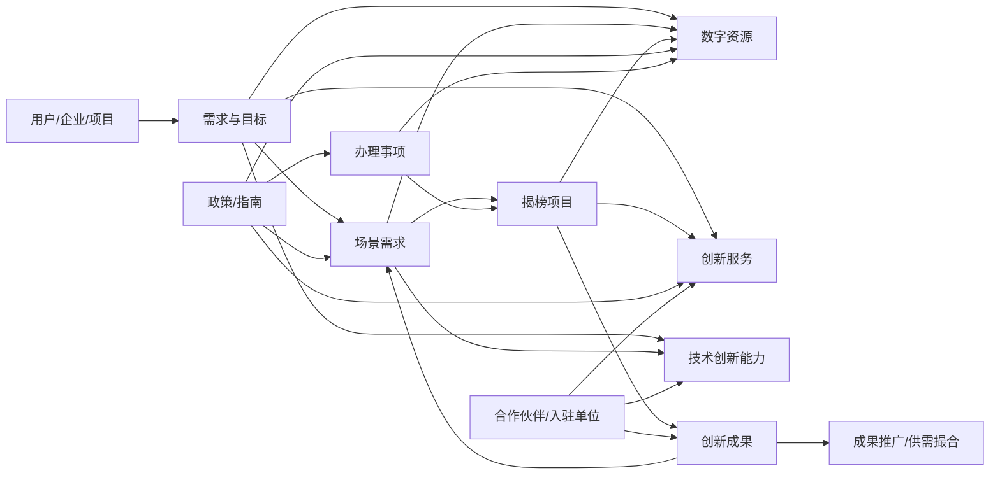
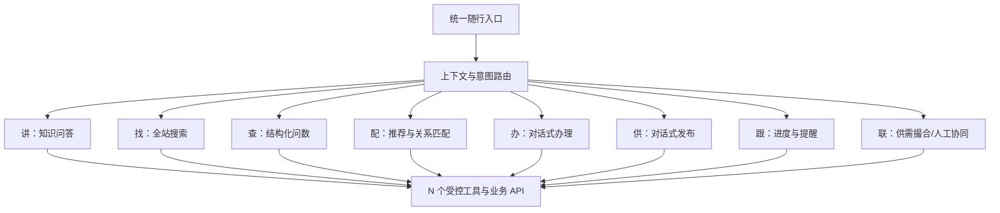
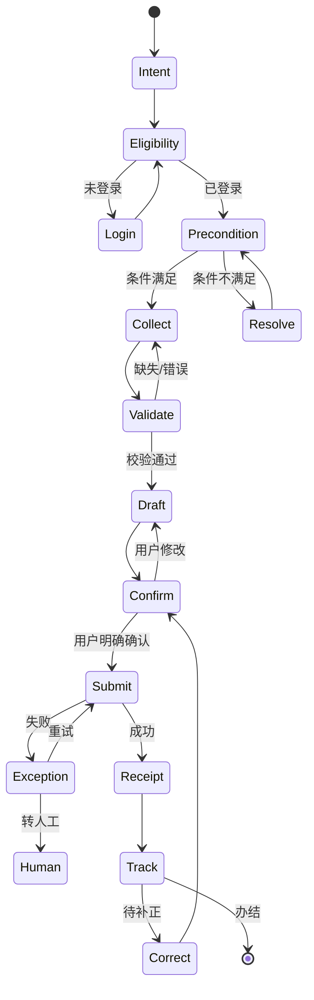
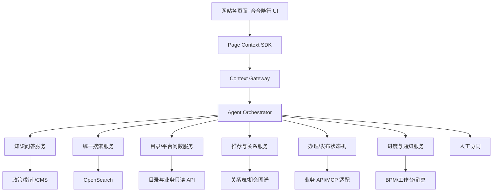
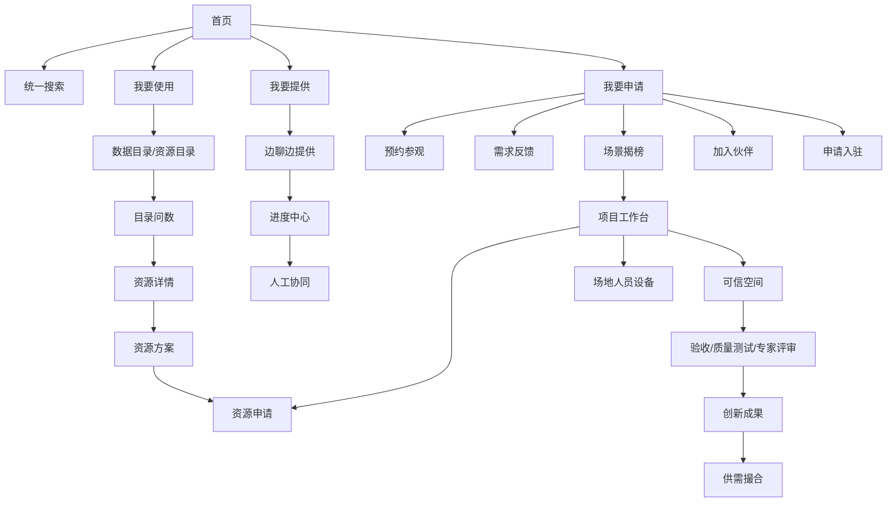

# 合合随行助手产品设计与原型生成规范（v1.1·全站内容增强版）

> 项目：数智北京创新中心“合合”智能助手  
> 文档性质：产品规划、交互规范、场景清单、AI 工程设计与原型生成说明  
> 适用对象：产品经理、交互/UI 设计师、原型生成智能体、前端、后端、算法、测试、运营和业务接口方  
> 资料范围：`dibj.cn` 公开站点、首页及内页截图、项目申报书、场景创新与数据创新用户手册、入驻及资源申请说明  
> 快照日期：2026-09-02  
> 版本说明：在 v1.0 基础上补齐全站对象、供给侧流程、场景/项目/成果/伙伴关系、四类问数、真实站点视觉适配与 32 页原型规范

---

## 0. 本次升级结论

### 0.1 v1.0 方向正确，但仍有六个结构性缺口

v1.0 已经明确了“随行浮窗、划线提问、页面上下文、目录问数、个性化推荐和边聊边办”，总体方向无需推翻。根据本轮首页及各栏目截图、全站公开内容和业务手册，仍需补齐：

1. **从页面知识问答升级为全站对象理解。**  
   合合不能只理解某段文字，还要理解“这是一个数据集、场景需求、入驻项目、创新成果、合作伙伴、政策或办理事项”，并知道对象之间的关系。

2. **从“我要申请”扩展为“我要使用、我要提供、我要申请”三条业务主线。**  
   现有 v1.0 对申请侧较完整，但对“提供数据、组件、场景、应用、服务”和供需撮合覆盖不足。

3. **从单一数据目录问数扩展为四类问数。**  
   除“某委办局有多少数据集”外，还应支持平台资源问数、个人业务问数和可信空间数据内容问数。

4. **从身份标签升级为“当前办事身份”。**  
   同一自然人可能同时是企业法人、企业成员、项目负责人、资源提供者或揭榜团队成员；合合必须显示当前以什么身份查看和办理。

5. **从统一深蓝原型风格改为“尊重原站、助手自适应”。**  
   真实网站存在首页蓝色主视觉、数据目录白底橙色筛选、应用成果绿色主题、场景页面米白卡片等多套页面风格。原型不能把所有页面重新绘成同一套深蓝大屏。

6. **从功能列表升级为可直接执行的原型契约。**  
   每一页必须明确：基础页面、用户身份、当前对象、触发动作、助手状态、回答卡片、可调用工具、异常状态和下一跳。

### 0.2 优化后的产品定义

> **合合是数智北京创新中心全站随行的“创新服务副驾”。**  
> 它始终可见但不过度打扰，能理解用户所在页面、当前栏目、正在查看的业务对象、选中的文字、当前身份与办理状态，帮助用户完成“讲、找、查、配、办、供、跟、联”八类任务。

| 用户动词 | 合合提供的能力 | 典型表达 |
|---|---|---|
| 讲 | 页面讲解、栏目导览、对象解读 | “这一块是干什么的？” |
| 找 | 全站语义搜索、跨对象发现 | “找交通客流相关的数据和项目” |
| 查 | 精确目录查询、统计、比较 | “市教委有多少数据集？” |
| 配 | 个性化推荐、资源组合方案 | “给医疗 AI 项目配一套数据和算力” |
| 办 | 对话式申请、补正、提交 | “我要申请算力” |
| 供 | 对话式发布数据、组件、场景、应用和服务 | “我要把我们的组件放到平台上” |
| 跟 | 进度、待办、材料和截止时间提醒 | “我的揭榜申请到哪一步了？” |
| 联 | 供需撮合、伙伴匹配、转人工专家 | “帮我找能做感知算法评测的伙伴” |

### 0.3 核心设计原则

- **可见性不等于持续占据焦点。** 合合应“随时可用、需要时主动、阅读时安静”。
- **页面上下文优先结构化注册，DOM 与截图理解只作兜底。**
- **知识回答、结构化查询、推荐和正式办理必须走不同引擎。**
- **原业务系统是身份、权限、状态和审批结果的唯一事实源。**
- **所有动态数量、名单、状态、政策有效性均从接口实时读取，不写死在原型与 Prompt 中。**
- **任何正式写操作均需结构化确认卡、用户明确确认、幂等控制和审计。**
- **外部链接页面默认不继承 DOM 感知能力，除非对方页面接入统一 SDK。**

---

## 1. 网站内容重新拆解：合合真正可以“懂”和“办”的对象

### 1.1 顶部导航不是八个菜单，而是八类服务空间

| 顶部栏目 | 网站实际内容 | 合合应承担的主要角色 |
|---|---|---|
| 首页 | 全站检索、我要使用/提供/申请、数据创新、场景培育、应用超市、新闻、活动、入驻单位 | 总入口、首次引导、跨模块路由 |
| 创新服务 | 数据创新、场景培育、评测验证、生态孵化、展示推广 | 服务诊断、资格判断、服务推荐 |
| 创新成果 | 应用创新、数据创新成果 | 成果搜索、相似案例、供需撮合 |
| 数字资源 | 云网算力、组件、共性服务、数据目录、技术创新能力 | 目录问数、资源解释、组合推荐、申请 |
| 我要提供 | 提供数据、组件、场景、应用、服务及其他 | 边聊边提供、材料辅助、分类推荐 |
| 我要申请 | 预约参观、需求反馈、我要揭榜、加入伙伴、申请入驻 | 事项路由、资格检查、边聊边办 |
| 政策解读 | 公共数据、数据要素、数据跨境、场景建设等政策解读 | RAG 问答、适用性判断、关联事项 |
| 关于我们 | 中心定位、总体架构、五大业务、一平台、三支撑、联系方式、常见问题 | 平台讲解、参观导览、人工兜底 |
| 走进创新中心 | 外景、南区办公区、北区展厅三维场景 | 虚拟讲解、空间导航、参观预约 |

### 1.2 首页可以挖掘的九类场景

首页不是一张宣传页，而是“需求发现到行动”的组合入口。

| 首页区块 | 页面现有内容 | 合合可增加的交互 |
|---|---|---|
| 顶部检索 | 全部、查需求、查成果、查资源、查资讯 | 自然语言改写、跨类型聚合、结果摘要、无结果转需求 |
| 我要使用 | 云网算、组件、共性服务、数据资源、技术创新能力 | 根据目标配资源；检查项目/团队前置条件 |
| 我要提供 | 数据、组件、场景、应用、服务 | 识别供给类型；启动发布向导；复用企业资料 |
| 我要申请 | 预约参观、需求反馈、揭榜、加入伙伴、申请入驻 | 资格检查；对话补全；提交与进度 |
| 数据创新 | 数据资源目录、入驻项目、外部链接 | 目录问数；项目案例匹配；外链边界提示 |
| 场景培育 | 揭榜中、对接中、已完成 | 需求匹配；截止提醒；生成揭榜材料 |
| 应用超市 | 应用创新成果、数智/数据创新成果 | 成果对比；相关场景；咨询对接 |
| 新闻资讯/活动 | 政策解读、通知、赛事、活动、典型案例 | 摘要、类型区分、订阅提醒、报名入口 |
| 入驻单位 | 当前入驻企业与机构 | 找合作方、找案例、找服务能力 |

### 1.3 创新服务的五大业务

| 一级业务 | 网站公开服务 | 合合可回答 | 合合可转办 |
|---|---|---|---|
| 数据创新 | 数据融合创新、数据竞赛服务 | 适合谁、能用哪些数据、可信环境是什么 | 在线申请、资源组合、竞赛服务咨询 |
| 场景培育 | 技术能力验证、应用场景验证 | 验证目标、条件、周期、案例 | 申请验证、匹配场景、揭榜 |
| 评测验证 | 大模型测评、感知算法测评 | 测什么、需要什么材料、输出什么 | 申请评测、补充材料、查进度 |
| 生态孵化 | 创新孵化空间和政策环境 | 入驻条件、支持内容、适配企业 | 申请入驻、预约参观、咨询 |
| 展示推广 | 展示推广、供需撮合 | 如何展示成果、如何找合作伙伴 | 发布成果、需求登记、对接洽谈 |

### 1.4 数字资源的五类资源对象

| 资源类型 | 可用数据与字段 | 合合任务 |
|---|---|---|
| 云网算力 | 计算规格、存储类型、获取条件、项目依赖 | 规格解释、项目适配、前置条件、申请 |
| 组件资源 | 分类、版本、架构、服务商、调用方式、下载地址、质量报告 | 组件搜索、兼容性问答、组合推荐、申请/提供 |
| 共性服务 | 京办、京智、京通、大数据平台、一图、一码、一感、一库 | 功能讲解、适用环境、需求反馈、参观预约 |
| 数据资源 | 公共数据、企业数据、联合实验室数据、高质量数据集 | 四类问数、数据推荐、加入清单、申请 |
| 技术创新能力 | 六大技术方向、内容描述、支持单位、重点应用领域 | 能力搜索、机构匹配、批量勾选、提交需求 |

### 1.5 数据目录公开快照

> 说明：以下为用户本轮截图中可见的目录快照，用于设计问数口径和原型示例。正式系统必须从目录 API 实时读取。数据主体标签存在多标签重叠的可能，不应将各标签数量直接相加。

#### 公共数据：10,659 项，按领域

| 分类 | 数量 | 分类 | 数量 | 分类 | 数量 |
| --- | ---: | --- | ---: | --- | ---: |
| 医疗卫生 | 91 | 教育文化 | 1,083 | 交通运输 | 614 |
| 社保就业 | 307 | 科技创新 | 283 | 财税金融 | 1,121 |
| 商贸流通 | 338 | 社会救助 | 62 | 体育健身 | 198 |
| 市场监管 | 208 | 公共安全 | 52 | 城建住房 | 418 |
| 生态环境 | 343 | 外事侨务 | 50 | 广播电视 | 74 |
| 民族宗教 | 12 | 法律服务 | 239 | 退役军人事务 | 118 |
| 气象服务 | 9 | 资源能源 | 477 | 地理空间 | 38 |
| 信用服务 | 72 | 安全生产 | 401 | 审计监督 | 224 |
| 政务管理 | 1,483 | 机构团体 | 1,419 | 人力资源 | 53 |
| 生活服务 | 74 | 工业农业 | 798 |  |  |

#### 公共数据：按数据主体标签

| 数据主体标签 | 数量 |
|---|---:|
| 个人类数据资源 | 1,653 |
| 法人类数据资源 | 4,092 |
| 区域类数据资源 | 1,903 |
| 政策文件类数据资源 | 2,897 |
| 其他类数据资源 | 3,430 |

#### 公共数据：截图可见的部门数量样例

| 分类 | 数量 | 分类 | 数量 |
| --- | ---: | --- | ---: |
| 北京市人力资源和社会保障局 | 678 | 北京市交通委员会 | 583 |
| 北京市教育委员会 | 566 | 北京市规划和自然资源委员会 | 471 |
| 北京市发展和改革委员会 | 432 | 北京市财政局 | 417 |
| 北京市住房和城乡建设委员会 | 411 | 北京市政务服务和数据管理局 | 401 |
| 北京市园林绿化局 | 396 | 北京市农业农村局 | 375 |
| 北京市市场监督管理局 | 356 | 北京市统计局 | 345 |
| 北京市文化和旅游局 | 343 | 北京市文物局 | 341 |
| 北京市水务局 | 328 | 北京市应急管理局 | 325 |
| 北京市民政局 | 315 | 北京市生态环境局 | 278 |
| 北京市城市管理委员会 | 278 | 北京市经济和信息化局 | 259 |
| 北京市卫生健康委员会 | 101 |  |  |

#### 企业数据：2,794 项，按行业

| 分类 | 数量 | 分类 | 数量 |
| --- | ---: | --- | ---: |
| 信息传输、软件和信息技术服务业 | 1,650 | 金融业 | 228 |
| 科学研究和技术服务业 | 190 | 卫生和社会工作 | 103 |
| 交通运输、仓储和邮政业 | 100 | 文化、体育和娱乐业 | 99 |
| 未分类/无 | 85 | 农、林、牧、渔业 | 78 |
| 水利、环境和公共设施管理业 | 66 | 电力、热力、燃气及水生产和供应业 | 33 |
| 制造业 | 32 | 建筑业 | 30 |
| 教育 | 24 | 房地产业 | 22 |
| 采矿业 | 14 | 租赁和商务服务业 | 13 |
| 批发和零售业 | 12 | 居民服务、修理和其他服务业 | 9 |
| 公共管理、社会保障和社会组织 | 4 | 住宿和餐饮业 | 2 |

#### 专题数据：联合实验室数据 678 项

| 分类 | 数量 | 分类 | 数量 |
| --- | ---: | --- | ---: |
| 空间图联合实验室数据 | 351 | 信令联合实验室数据 | 309 |
| 国家人工智能应用中试基地（医疗）·北京 | 9 | 数智教育实验室数据 | 8 |
| 数智消费实验室 | 1 |  |  |

#### 高质量数据集：364 项，按行业

| 分类 | 数量 | 分类 | 数量 |
| --- | ---: | --- | ---: |
| 信息传输、软件和信息技术服务业 | 268 | 科学研究和技术服务业 | 24 |
| 卫生和社会工作 | 15 | 交通运输、仓储和邮政业 | 13 |
| 金融业 | 9 | 制造业 | 7 |
| 房地产业 | 7 | 电力、热力、燃气及水生产和供应业 | 5 |
| 租赁和商务服务业 | 5 | 教育 | 3 |
| 采矿业 | 3 | 建筑业 | 3 |
| 居民服务、修理和其他服务业 | 1 | 文化、体育和娱乐业 | 1 |

### 1.6 场景、项目、成果、伙伴与资讯

| 对象 | 页面结构 | 可挖掘的智能服务 |
|---|---|---|
| 场景需求 | 揭榜中、对接中、已完成；名称、发布单位、需求描述、日期 | 场景匹配、资格评估、截止提醒、相似场景、揭榜方案 |
| 入驻项目 | 企业名称、项目名称；当前公开页可见 43 条 | 行业案例搜索、相似项目、合作主体、资源组合 |
| 应用创新成果 | 产品分类、成果说明、场景分类、上架时间 | 解决方案推荐、成熟度比较、咨询对接 |
| 数据创新成果 | 数据集、API、数据应用、数据报告等 | 数据产品推荐、可用数据链路、应用场景 |
| 技术创新能力 | 六大方向、支持单位、应用领域 | 找技术、找机构、能力供需匹配 |
| 合作伙伴 | 类型、公司/机构、业务类型；当前公开列表 87 条 | 找评测伙伴、实验室伙伴、数据创新伙伴 |
| 新闻资讯 | 专家解读、政策更新、通知、公示、案例、赛事 | 摘要、真实性来源、时效提示、订阅 |
| 活动预告 | 活动名称、日期、报名/通知 | 活动匹配、日程提醒、预约 |
| 入驻单位 | 企业/机构 Logo 与项目 | 合作发现、案例关联、能力画像 |

### 1.7 关于我们与三维场景

合合在“关于我们”与“走进创新中心”中不应只做文字问答，还应成为虚拟讲解员：

- 解释中心四个定位：智慧城市资源集聚区、数据要素创新策源地、城市数智化建设新范式、数字产业生态构建新引擎；
- 解读“总体架构、五大业务、一平台、三支撑”；
- 在三维场景中感知外景、南区办公区、北区展厅；
- 根据参观者身份生成不同讲解路线；
- 将“线上浏览”平滑转为“预约参观”；
- 对外部联系方式、开放时间、预约规则等时效信息显示更新时间。

---

## 2. 必须建立统一术语与对象字典

截图和网页中存在多个相近词，若不统一，合合会出现搜索漏召回、路由错误和文案混乱。

### 2.1 术语别名

| 规范对象 | 网站可见别名或相近词 | 处理规则 |
|---|---|---|
| 场景创新 | 场景培育、场景需求、场景揭榜、场景验证 | 检索可互召回，回答时保留页面原词并解释关系 |
| 创新成果 | 应用超市、应用创新成果、数智创新成果、数据创新成果 | 先识别成果类型，再返回对应目录 |
| 数据目录 | 数据资源目录、数据目录（互联网）、公共数据目录 | 统一实体 `data_catalog`，保留数据类型 |
| 专题数据 | 联合实验室数据、高质量数据集 | 专题数据为父类，两个子类不能混为一类 |
| 资源申请 | 立即申请、加入清单、购物车、我的资源 | 区分收藏/清单/草稿/正式申请 |
| 入驻 | 申请入驻、入驻单位、入驻项目 | 分别为办理事项、组织实体、项目实体 |
| 资讯 | 新闻、通知、公示、专家解读、政策解读、活动预告 | 必须按内容类型与发布时间分类 |
| 技术能力 | 技术创新能力、能力清单、能力项 | 统一为 `technical_capability` |
| 共性服务 | 京办、京智、京通、一图、一码、一感、一库、大数据平台 | 作为八个独立服务实体 |

### 2.2 对象主键要求

任何合合可回答、推荐或办理的对象，都必须具有稳定主键，不允许只依赖显示名称：

```json
{
  "entity_type": "dataset | scene | project | result | service | capability | partner | policy | news | event | matter",
  "entity_id": "stable-business-id",
  "display_name": "页面展示名称",
  "source_system": "catalog | scene-system | result-system | cms | bpm",
  "source_url": "/path/to/detail",
  "version": "optional",
  "updated_at": "ISO-8601"
}
```

---

## 3. 从页面地图升级为“创新机会关系图”

### 3.1 核心关系



### 3.2 产品价值

用户通常不会只问一个孤立对象。例如：

> “我们做城市客流预测，平台能给什么帮助？”

合合应同时返回：

- 相关公共数据、企业数据、信令和空间图实验室数据；
- 云网算力和时空分析组件；
- 当前揭榜中的交通场景；
- 已完成的类似项目和成果；
- 可申请的数据创新、场景验证或评测服务；
- 可合作的技术能力单位；
- 涉及的数据合规与使用政策；
- 一键形成“我的创新方案”。

一期可以先用关系表和规则实现，不必一开始就建设复杂知识图谱。二期再将高价值关系进入图谱/KAG，用于多跳推理和解释。

---

## 4. 用户身份、当前办事身份与个性化边界

### 4.1 身份模型

| 身份/角色 | 可见能力 | 可办理能力 |
|---|---|---|
| 匿名访客 | 平台导览、公开搜索、公开目录问数、政策/资讯问答、公开案例 | 预约参观、需求反馈；其他事项引导登录 |
| 已登录个人 | 以上能力＋个人收藏、历史会话、订阅 | 申请企业认证、查看个人待办 |
| 待企业认证个人 | 企业认证状态、缺失材料 | 补正、撤回或重新申请认证 |
| 企业法人 | 企业画像、企业成员、项目、资源和申请 | 项目申报、揭榜确认、创建团队、供给发布、入驻/伙伴申请 |
| 企业成员 | 企业授权范围内的项目与资源 | 由权限决定，不能默认代表法人提交 |
| 项目负责人 | 单项目全生命周期与团队资源 | 资源、场地、人员、设备、材料、验收、推广等 |
| 项目成员 | 当前项目授权资源与任务 | 只执行被授权任务 |
| 政府需求发布/审核人员 | 场景、需求、审核与统计 | 发布需求、审核、结果反馈 |
| 专家/评测人员 | 被分配的测评或评审材料 | 评测、评审、提交意见 |
| 平台运营人员 | 全站运营视图、配置和日志 | 内容配置、规则管理、人工接力、运营问数 |

### 4.2 当前办事身份必须可见

同一用户可能有多个角色。助手展开态顶部应显示：

```text
当前身份：合合科技有限公司 · 企业法人
当前项目：城市交通客流预测项目
切换身份 / 切换项目
```

任何正式操作前再次展示“将以谁的身份、为哪个项目提交”。

### 4.3 记忆分层

| 记忆类型 | 示例 | 保存方式 |
|---|---|---|
| 会话短记忆 | 最近几轮问题、当前引用文字 | 当前会话 |
| 页面任务记忆 | 当前筛选、正在填写的草稿 | 会话/任务状态 |
| 用户偏好记忆 | 行业、关注领域、通知偏好 | 用户授权后的长期画像 |
| 项目上下文 | 当前项目目标、团队、已选资源 | 业务系统实时查询 |
| 业务状态 | 审批中、待补正、已完成 | **不作为模型记忆**，每次从业务系统读取 |
| 权限 | 角色、可见范围、可写范围 | **不作为模型记忆**，每次鉴权 |

### 4.4 个性化服务示例

#### 匿名访客

- 首次访问时先问“您是想了解平台、找资源、参观还是合作？”
- 根据当前浏览栏目推荐公开内容；
- 可公开问数，但不显示非公开字段或受限详情；
- 遇到申请操作，解释登录与身份要求；
- 允许预约参观、需求反馈；
- 不建立隐性跨会话画像，除非用户明确同意。

#### 企业法人

- 复用企业基础信息，避免所有表单重复填写；
- 根据行业、项目和历史申请推荐资源；
- 主动提示项目、团队、企业认证等前置条件；
- 首页优先显示待办、即将截止、待补正和可继续草稿；
- 可启动“边聊边提供”。

#### 项目负责人

- 优先展示项目全生命周期、可操作节点和阻塞原因；
- 推荐当前阶段需要的数据、算力、组件、场地和服务；
- 对灰色按钮解释原因并给出下一步；
- 提醒材料、资源到期、验收和推广节点。

---

## 5. 随行助手交互架构

### 5.1 不是“跟着页面移动”，而是“固定视口＋内容锚定”

合合应固定于浏览器视口，不随正文坐标上下跳动。页面滚动时，它保持相对稳定，同时更新当前上下文。

#### 推荐位置策略

| 页面情况 | 折叠入口位置 | 展开方式 |
|---|---|---|
| 首页右侧存在赛事竖幅 | 左侧中下或右侧竖幅上方避让 | 侧边抽屉 |
| 普通列表页 | 右侧中下 | 宽屏推挤正文；窄屏覆盖 |
| 右侧已有筛选/详情栏 | 左侧中下 | 从左侧展开或底部展开 |
| 三维场景 | 右下但避开控制器 | 半透明侧栏 |
| 办理表单 | 右侧吸附 | 任务抽屉/全屏任务态 |
| 移动端 | 底部 Dock | Bottom Sheet |

#### 避让机制

页面通过 SDK 注册 `avoid_zones`：

```json
[
  {"id":"competition-banner","rect":"dynamic","priority":10},
  {"id":"back-to-top","rect":"dynamic","priority":8},
  {"id":"main-submit","rect":"dynamic","priority":10}
]
```

助手自动选择可见性最好且不遮挡主操作的位置。用户拖动后记住位置，但路由切换时重新校验是否冲突。

### 5.2 五种 UI 状态

| 状态 | 形态 | 使用场景 |
|---|---|---|
| 陪伴点 | 48–64px 吉祥物头像＋在线点 | 默认常驻 |
| 轻提示 | 一句话气泡，3–6 秒自动收起 | 停留、无结果、禁用操作、截止提醒 |
| 划线工具条 | “问合合/解释/找相关/去办理” | 用户选择文字 |
| 页面副驾 | 360–440px 侧栏，含上下文条和卡片 | 连续问答、搜索、推荐、进度 |
| 任务工作台 | 720px 抽屉或全屏双栏 | 多步骤办理、材料、确认和提交 |

### 5.3 页面内“合合锚点”

除全局浮窗外，重点模块可在 hover 或 focus 时出现一个轻量锚点：

```text
合合可讲解
```

点击后将该模块注册为当前上下文，并打开侧栏。锚点不长期占位，不在每张卡片上都放机器人图标。

### 5.4 主动交互强度

| 级别 | 触发 | 表现 |
|---|---|---|
| L0 静默 | 正常浏览、快速滚动 | 只保留陪伴点 |
| L1 可发现 | 首次 hover、键盘 focus | 显示“合合可讲解” |
| L2 轻提示 | 停留较久、重复查看、无结果 | 一句话提示，不自动打开 |
| L3 建议行动 | 禁用按钮、前置条件缺失、即将截止 | 提示＋一个明确 CTA |
| L4 强提醒 | 待补正、提交失败、安全风险 | 需用户关闭的业务提醒，但不抢占输入 |

#### 防打扰规则

- 用户连续滚动、正在输入、播放视频或三维交互时不主动提示；
- 同一区块轻提示 24 小时最多 1 次；
- 用户点击“不再提示”后该类提示进入偏好设置；
- 不在页面加载完成后自动打开大侧栏；
- 所有主动提示必须说明“为什么现在提示”。

### 5.5 对实际网站主题自适应

真实站点并非统一深蓝色，因此合合应有两套外壳：

| 页面背景 | 助手外壳 |
|---|---|
| 蓝色图片/深色三维场景 | 深色半透明面板＋白字 |
| 白底/橙色目录/米白卡片 | 白色面板＋深蓝文字＋品牌红 CTA |
| 绿色成果主题 | 白色面板，不跟随页面绿色改变主品牌 |
| 高对比图片区域 | 自动加实色底和描边 |

禁止把现有站点所有页面重绘成大屏深蓝风；原型应保留原站视觉，合合是增量层。

---

## 6. 页面关注区块与上下文推断

### 6.1 合合不能读心，只能根据行为信号推断

当前关注区块由以下信号组合：

```text
关注分 =
可见面积 30%
+ 距离视口中心 20%
+ 连续停留 20%
+ 最近点击/键盘焦点 15%
+ 鼠标轨迹/重复悬停 10%
+ 页面业务优先级 5%
```

### 6.2 上下文优先级

```text
用户明确引用/划线
> 当前点击对象
> 当前表单字段或错误
> 当前激活 Tab
> 视口焦点区块
> 页面主对象
> 最近对话
> 用户画像
```

低于置信度阈值时必须澄清：

> “您说的‘这个’，是指当前选中的‘药品批准信息’，还是整个公共数据目录？”

### 6.3 上下文可视化

侧栏顶部始终显示：

```text
当前页面：数字资源 / 数据目录
当前范围：公共数据 / 部门 / 北京市教育委员会
当前对象：中小学学校基本信息
```

用户可以逐项删除、锁定或切换，避免“模型自以为懂”。

---

## 7. Page Context SDK 与 Context Gateway

### 7.1 页面注册契约

```ts
registerHehePage({
  pageId: "public-data-catalog",
  pageType: "catalog-list",
  title: "公共数据目录",
  route: "/cxfuww/szzyml/sjml/",
  sourceSystem: "resource-catalog",
  theme: "light",
  sensitivity: "public",
  sourceUpdatedAt: "2026-09-02T12:00:00+08:00",
  supportedIntents: ["explain", "search", "count", "filter", "recommend", "apply"],
  primaryEntity: null,
  sections: [
    {
      sectionId: "catalog-filter",
      title: "公共数据筛选",
      entityType: "catalog",
      queryDimensions: ["domain", "subject", "department"],
      assistantPrompts: [
        "这些分类有什么区别？",
        "哪个部门的数据最多？",
        "帮我找教育领域开放数据"
      ]
    }
  ],
  avoidZones: ["global-banner", "pagination", "back-to-top"]
});
```

### 7.2 对象注册

```ts
registerHeheEntity({
  entityType: "dataset",
  entityId: "dataset-10482",
  displayName: "药品批准信息（归集中）",
  sourceSystem: "resource-catalog",
  fieldsAllowedForAssistant: [
    "displayName", "department", "domain",
    "openStatus", "shareStatus", "updatedAt", "summary"
  ],
  actions: ["view_detail", "favorite", "add_to_plan", "apply"]
});
```

### 7.3 状态与身份

```ts
updateHeheState({
  actingIdentity: {
    type: "enterprise_legal_person",
    organizationId: "org-001",
    organizationName: "示例企业"
  },
  currentProject: {
    id: "project-001",
    name: "交通客流预测项目"
  },
  activeTab: "department",
  filters: {
    departmentId: "edu",
    openStatus: "all"
  },
  taskState: {
    draftId: null,
    missingFields: []
  }
});
```

### 7.4 Context Gateway 职责

- 过滤 Cookie、Token、隐藏 DOM、脚本和无关文本；
- 对手机号、身份证号、信用代码等字段脱敏；
- 只发送白名单字段；
- 合并页面、对象、身份、任务和对话上下文；
- 计算上下文置信度；
- 标记来源类型和更新时间；
- 对网页文本做“数据而非指令”隔离，防止间接提示词注入；
- 控制 Token 和增量更新；
- 输出可审计的 `context_snapshot_id`。

---

## 8. 合合能力架构：1＋8＋N



### 8.1 路由矩阵

| 意图 | 例句 | 主引擎 | 必要工具 |
|---|---|---|---|
| 页面讲解 | “这一块是什么？” | 页面上下文＋RAG | 页面注册表 |
| 全站搜索 | “找交通数据和案例” | OpenSearch 混合检索 | 统一搜索 API |
| 目录问数 | “市教委有多少数据集？” | 受控 DSL 查询 | 目录查询 API |
| 平台问数 | “揭榜中的场景有多少？” | 平台对象查询 | 场景/成果/CMS API |
| 个人问数 | “我有几个申请待补正？” | 业务查询 | 工作台/BPM API |
| 政策问答 | “公共数据能否商用？” | 版本化 RAG | 政策库 |
| 资源推荐 | “给我配一套算力和数据” | 规则＋检索＋重排 | 目录/画像/项目 API |
| 办理 | “我要预约参观” | 状态机 | 事项 API |
| 发布 | “我要提供一个组件” | 状态机＋文案辅助 | 发布 API/文件 API |
| 进度 | “申请到哪了？” | 状态查询 | BPM/消息 API |
| 撮合 | “找感知算法评测伙伴” | 关系匹配 | 伙伴/能力/成果 API |
| 转人工 | “找专家帮我判断” | 人工协同 | 工单/客服 API |

---

## 9. 全站页面服务矩阵

### 9.1 首页

| 当前区块 | 合合默认理解 | 推荐问题 | 可行动作 |
|---|---|---|---|
| 顶部搜索 | 用户想跨栏目找信息 | “你想找数据、需求、成果还是资讯？” | 执行统一搜索 |
| 我要使用 | 用户需要平台资源 | “告诉我项目目标，我帮你配资源” | 生成资源方案 |
| 我要提供 | 用户希望向平台供给能力 | “你要提供数据、组件、场景、应用还是服务？” | 发布向导 |
| 我要申请 | 用户准备办理事项 | “预约、反馈、揭榜、伙伴还是入驻？” | 资格检查＋办理 |
| 数据创新 | 用户关注数据与案例 | “按部门查数据”“找相似入驻项目” | 目录问数/案例推荐 |
| 场景培育 | 用户关注创新需求 | “查看即将截止的揭榜场景” | 场景匹配/揭榜 |
| 应用超市 | 用户找解决方案 | “按行业查成熟成果” | 成果推荐/对接 |
| 新闻资讯 | 用户了解政策与动态 | “这是政策、通知还是新闻？” | 摘要/订阅 |
| 入驻单位 | 用户找合作方 | “找有某项能力的入驻企业” | 伙伴匹配 |

### 9.2 创新服务

合合在该页应先做“服务诊断”，而不是展示所有卡片：

```text
用户目标 → 项目阶段 → 是否有真实场景/数据 → 是否要评测 → 是否需空间/推广
```

输出：

- 推荐的创新服务；
- 适用原因；
- 前置条件；
- 需要准备的材料；
- 预计后续流程；
- “立即咨询/申请”的唯一主 CTA。

### 9.3 创新成果

- 对成果生成一句话解读、适用对象、成熟度和对接方式；
- 根据当前场景/项目找相似成果；
- 根据成果反查所需数据、组件和技术能力；
- 把“查看详情”升级为“了解—比较—对接”；
- 对应用创新和数据创新成果采用不同字段模板。

### 9.4 数字资源

- 识别五类资源及各自获取条件；
- 对共性服务明确“仅限中心环境使用”；
- 对云网算明确“需法人身份、项目和团队”；
- 对组件目录未登录状态提供登录原因而不是只弹窗；
- 对技术能力支持多项选择、形成需求清单；
- 目录列表页支持精确问数和跨分类比较。

### 9.5 我要提供

新增“边聊边提供”作为独立产品能力：

- 自动识别供给类型；
- 从企业画像预填通用企业信息；
- 生成资源名称和摘要建议；
- 推荐分类与标签；
- 检查附件、Logo、版本、架构、调用方式和质量测试报告；
- 生成预览；
- 明确提交后的审核流程；
- 支持草稿、继续办理和进度。

### 9.6 我要申请

- 先判断访客/个人/法人/项目负责人；
- 显示事项条件、材料和预计流程；
- 对不满足条件的事项给出最短前置路径；
- 五大事项分别保持独立状态机；
- 统一回执、进度、补正和撤回体验。

### 9.7 政策解读

- 区分政策原文、专家解读、新闻报道和通知；
- 展示发布机构、发布日期、有效状态和来源；
- 回答“是什么”之外，还要回答“与我有什么关系”和“下一步能办什么”；
- 对时效敏感问题实时检索，禁止仅靠模型记忆；
- 可将政策关联到场景、服务、资源和办理事项。

### 9.8 关于我们与三维场景

- 作为平台虚拟讲解员；
- 根据访客、企业、高校、政府人员生成不同导览；
- 支持从三维点位直接提问；
- 讲解结束后提供预约参观或人工咨询；
- 外景、南区办公区、北区展厅作为三个独立上下文对象。

---

## 10. 普通问答与政策咨询场景库

### 10.1 平台认知

| 用户问法 | 回答结构 |
|---|---|
| “这个平台是做什么的？” | 一句话定位＋五大业务＋适合谁＋三个推荐入口 |
| “企业来这里能得到什么？” | 数据、算力、验证、孵化、推广和撮合 |
| “高校团队适合从哪里开始？” | 数据目录＋场景需求＋数据创新＋合作伙伴 |
| “公众能做什么？” | 了解、搜索、政策、活动、参观、反馈 |
| “互联网端与政务外网有什么区别？” | 环境、登录方式、可操作事项、安全边界 |

### 10.2 创新服务咨询

- “数据融合创新和应用场景验证有什么区别？”
- “大模型测评会测哪些内容？”
- “感知算法测评需要提供什么？”
- “我们有产品但没有真实场景，适合哪项服务？”
- “成果怎么在平台展示和推广？”
- “初创企业能否申请孵化空间？”

回答必须包含：

1. 服务定义；
2. 适用对象；
3. 典型输入与产出；
4. 前置条件；
5. 可申请入口；
6. 来源与更新时间。

### 10.3 资源咨询

- “物理服务器和弹性云服务器怎么选？”
- “对象存储适合什么数据？”
- “共性服务为什么只能在中心环境使用？”
- “京办、京智、京通分别能做什么？”
- “有哪些数据智能技术能力？”
- “组件是否支持国产架构？”
- “质量测试报告是否必填？”

### 10.4 场景、项目、成果与伙伴

- “最近有哪些交通类揭榜场景？”
- “哪些项目使用过公共数据做信贷风控？”
- “有没有养老政策匹配的入驻项目？”
- “找能做政务大模型测评的伙伴。”
- “这个成果是否已经商业化？”
- “帮我比较三个相似成果。”
- “根据这个已完成场景推荐可复用成果。”

### 10.5 新闻、政策和活动

- “最近有哪些高质量数据集相关政策？”
- “这篇是政策原文还是专家解读？”
- “数据要素大赛什么时候截止？”
- “有哪些可以报名的活动？”
- “帮我订阅交通、公共数据和大模型评测资讯。”

### 10.6 回答卡片标准

每个知识回答至少包含：

```text
核心回答
适用对象/当前用户影响
关键条件或风险
相关页面/事项
来源与更新时间
继续追问建议
```

---

## 11. 问数体系：不止“数据目录问数”

### 11.1 四类问数

| 层级 | 数据范围 | 典型问题 | 实现 |
|---|---|---|---|
| A. 目录问数 | 公共、企业、实验室、高质量数据集 | “市教委有多少数据集？” | 目录 DSL/API |
| B. 平台对象问数 | 场景、项目、成果、伙伴、资源、资讯 | “揭榜中的交通场景有多少？” | 对象查询服务 |
| C. 个人业务问数 | 我的项目、申请、待办、资源、消息 | “我有几个事项待补正？” | 业务 API |
| D. 数据内容问数 | 已授权真实数据内容 | “按区分析近三年客流变化” | 可信空间只读分析 |

### 11.2 目录问数维度

#### 公共数据

- 类型：公共数据；
- 领域；
- 数据主体标签；
- 部门；
- 关键词；
- 开放状态；
- 共享状态；
- 更新时间；
- 分页、排序、分组和比较。

#### 企业数据

- 行业；
- 提供方；
- 数据名称；
- 服务类型；
- 可用方式；
- 更新时间。

#### 联合实验室数据

- 实验室；
- 数据类型；
- 主题；
- 来源；
- 可申请范围。

#### 高质量数据集

- 行业；
- 训练/评测用途；
- 模态；
- 标注类型；
- 数据规模；
- 质量指标；
- 许可与开放条件。

### 11.3 平台对象问数

典型问题：

- “揭榜中、对接中、已完成场景分别有多少？”
- “目前有哪些医疗类入驻项目？”
- “有多少家合作伙伴参与政务大模型评测？”
- “应用创新成果按场景分类怎么分布？”
- “最近一个月发布了多少政策解读和赛事通知？”
- “97 项技术能力中哪些属于数据安全？”

### 11.4 受控查询 DSL

```json
{
  "query_domain": "data_catalog",
  "entity": "dataset",
  "filters": [
    {"field": "catalog_type", "operator": "eq", "value": "public"},
    {"field": "department_id", "operator": "eq", "value": "beijing_edu"}
  ],
  "metrics": [
    {"type": "count", "alias": "dataset_count"}
  ],
  "group_by": ["domain", "open_status"],
  "sort": [{"field": "updated_at", "direction": "desc"}],
  "page": 1,
  "page_size": 20
}
```

模型只能生成白名单 DSL；查询服务负责字段映射、权限注入、执行、限流和口径校验。

### 11.5 多轮继承

```text
用户：市教委有多少数据集？
合合：566 项（实时结果）。
用户：只看教育文化领域。
合合：继承部门=市教委，增加领域=教育文化。
用户：最近半年更新的呢？
合合：继续增加更新时间条件。
用户：前 20 个加入方案。
合合：展示清单，用户确认后执行轻写操作。
```

### 11.6 问数回答卡

- 精确总数；
- 查询口径；
- 维度分布；
- 前 N 项列表；
- 数据更新时间；
- “查看全部、继续筛选、导出清单、加入方案”；
- 若统计口径可能重叠，明确说明；
- 若接口不可用，不能用 RAG 猜数量。

### 11.7 数据内容问数边界

仅在政务外网/可信数据空间内开放，并具备：

- 只读语义层；
- 行列级权限；
- SQL AST 校验；
- 查询量、耗时和并发限制；
- 隐私小样本与敏感字段保护；
- 导出审批；
- 查询与结果全审计；
- 不将原始数据带回互联网端会话。

---

## 12. 个性化推荐与供需撮合

### 12.1 推荐不应只依靠浏览历史

推荐信号优先级：

1. 资格和权限硬约束；
2. 当前项目目标、阶段和行业；
3. 用户明确表达的需求；
4. 当前页面与当前对象；
5. 已选择资源和历史申请；
6. 浏览、收藏和搜索行为；
7. 相似项目/组织的匿名聚合经验。

### 12.2 推荐对象

- 数据集；
- 云网算力；
- 组件与工具；
- 共性服务；
- 技术创新能力；
- 创新服务；
- 场景需求；
- 创新成果；
- 入驻项目案例；
- 合作伙伴；
- 政策、资讯与活动；
- 办理事项。

### 12.3 资源组合包

示例：企业要做“医疗影像模型验证”。

```text
核心数据：医疗影像高质量数据集
补充数据：企业/区域相关数据
算力：GPU 训练与对象存储
组件：影像预处理、标注、模型评估
服务：数据合规评估、大模型/算法测评
案例：相似医疗项目与成果
政策：相关支持和合规要求
下一步：数据创新申请或评测验证
```

### 12.4 推荐解释

用户默认看到 2–4 条业务解释，不显示复杂模型分数：

- “与您当前医疗 AI 项目高度相关”；
- “处于研发验证阶段，可直接用于模型评测”；
- “您已具备企业和项目资格，可发起申请”；
- “该资源需在可信空间使用”。

“评分明细”作为可展开内容，且区分：

- 资格匹配；
- 语义匹配；
- 阶段匹配；
- 可用性；
- 时效性；
- 历史效果。

### 12.5 伙伴与合作匹配

合合可将合作伙伴、入驻单位、技术能力和成果组合成“合作建议”：

> “您需要感知算法测评。平台当前已有评测标准、评测数据集、评测服务和应用生态四类伙伴，我已按您需要的服务类型筛选。”

必须避免直接把“合作伙伴名单”当成商业背书；明确数据来源和业务类型。

---

## 13. 边聊边办与边聊边提供的统一状态机

### 13.1 通用流程



### 13.2 卡片化原则

- 对话负责理解、解释和追问；
- 结构化卡片负责填写和校验；
- 确认卡负责风险与提交；
- 回执卡负责正式结果；
- 进度卡负责持续跟踪；
- 复杂表单进入任务工作台，不在 400px 浮窗中硬塞。

---

## 14. 已明确的边聊边办业务

### 14.1 预约参观

#### 场景

访客在首页、关于我们或三维场景中说：

> “我想周五带 8 个人来参观。”

#### 流程

1. 识别团队/个人预约；
2. 查询最新开放时间和预约规则；
3. 收集日期、时段、人数、单位、联系人、电话、来访目的；
4. 校验容量和提前预约要求；
5. 展示隐私与入场证件提醒；
6. 用户确认；
7. 提交预约；
8. 返回预约编号、时间、地点和后续通知方式；
9. 支持取消、修改和查进度。

### 14.2 需求反馈

#### 适用入口

- 首页无结果；
- 共性服务使用需求；
- 尚未提供的数据、技术或服务；
- 外部链接无法满足；
- 用户主动反馈。

#### 流程

需求分类 → 当前页面/查询条件自动带入 → 单位和联系人 → 需求描述 → 期望时间 → 附件 → 确认 → 回执 → 分派与跟踪。

### 14.3 个人申请企业认证

登录个人 → 读取是否已有企业身份 → 搜索/填写企业 → 提交证明 → 法人审核 → 状态提醒 → 补正/撤回。

### 14.4 数据、组件、云网算和模型资源申请

前置检查：

- 是否法人/授权项目人员；
- 项目是否已立项；
- 团队是否已创建；
- 当前资源所属环境；
- 是否满足获取条件。

采集：

- 项目；
- 申请人；
- 使用目标；
- 资源类型和规格；
- 使用时间；
- 数据用途和安全承诺；
- 申请依据；
- 附件。

### 14.5 技术创新能力需求登记

用户可以多选能力项。合合应：

1. 解析项目需求；
2. 从六类技术能力中筛选；
3. 展示技术方向、支持单位、应用领域；
4. 形成能力清单；
5. 复用企业信息；
6. 提交登记；
7. 返回对接回执并进入消息中心。

### 14.6 场景揭榜

流程：

场景解读 → 法人资格 → 匹配度与风险 → 企业信息复用 → 资质/产品/研发人员 → 实施方案 → 技术方案 → 创新点 → 附件 → 完整度检查 → 确认申报 → 路演通知/回执 → 排期 → 中榜确认。

合合可以生成草稿和结构建议，但不得编造企业资质、案例和承诺。

### 14.7 加入伙伴

- 识别希望加入的合作类型；
- 根据伙伴体系推荐业务类型；
- 收集企业和能力信息；
- 上传证明；
- 提交并跟踪；
- 通过后更新合作伙伴画像。

### 14.8 申请入驻

- 企业类型和项目适配；
- 空间与服务需求；
- 项目介绍；
- 计划入驻时间；
- 人员规模；
- 资源需求；
- 参观/咨询；
- 提交与审核。

### 14.9 场地、人员和设备链式办理

```text
场地/工位审核通过
    ↓
人员进场、设备进场才可申请
    ↓
进场审核
    ↓
线下门禁与政务外网开通
```

合合必须识别链式依赖，不能同时无条件开放所有按钮。

### 14.10 数据创新与场景创新生命周期

- 项目创建/申请；
- 审核通过；
- 创建团队；
- 资源、场地、人员、设备；
- 政务外网动态码；
- 材料/进度上报；
- 可信空间开发；
- 开发验证；
- 场景验收或产品上架；
- 第三方质量测试；
- 专家评审；
- 示范推广；
- 结果回传。

---

## 15. 新增：边聊边提供

### 15.1 提供数据

必填与辅助：

- 企业通用信息；
- 数据名称；
- 数据介绍；
- 覆盖范围、时间范围、更新频率；
- 数据格式与规模；
- 权属与许可；
- 开放/申请方式；
- 合规与脱敏说明；
- 样例和附件。

合合应检查“名称是否清晰、用途是否明确、来源和权属是否说明、是否含敏感信息”。

### 15.2 提供组件

网页现有字段较多，应设计为五步而不是一张长表：

1. 组件基础信息；
2. 分类与兼容性；
3. 调用/安装方式；
4. 企业信息；
5. 质量与提交。

关键字段：

- 名称、分类、服务商；
- 版本、支持架构；
- Logo；
- 说明；
- 调用方式；
- 安装包地址；
- 第三方质量测试报告；
- 填写说明和打包规范附件。

合合可根据说明自动推荐分类，但最终由用户确认。

### 15.3 提供场景

- 场景名称、背景、痛点；
- 开放单位；
- 真实数据/环境；
- 需要能力；
- 预期效果；
- 支持方式；
- 时间和联系人；
- 附件。

### 15.4 提供应用

- 应用名称；
- 复制推广意义；
- 适用行业/场景；
- 部署方式；
- 成熟度；
- 案例；
- 安全/信创；
- 试用或对接方式。

### 15.5 提供服务

网站明确包括数据治理、评测认证、规划咨询、智库专家、人才培训、金融投资等。合合应帮助确定服务类型、交付物、服务周期、适用对象和对接方式。

### 15.6 提供其他

“其他”不能成为不可运营的兜底框。合合先尝试归类；无法归类时，以“项目介绍＋期望合作方式”形成线索单，并进入运营人工分派。

---

## 16. UI 回答与任务组件协议

### 16.1 KnowledgeAnswerCard

```yaml
title: 核心回答
summary: 1-3 句
sections:
  - 适用对象
  - 关键条件
  - 办理建议
sources:
  - title
    organization
    published_at
    updated_at
    url
actions:
  - 查看原文
  - 相关服务
  - 开始办理
```

### 16.2 CatalogQueryCard

```yaml
query_scope:
total:
updated_at:
distribution:
  - dimension
    items
preview_list:
  - entity_id
    name
    metadata
actions:
  - 继续筛选
  - 查看全部
  - 导出清单
  - 加入方案
```

### 16.3 RecommendationBundleCard

```yaml
goal:
eligibility:
bundle:
  datasets: []
  compute: []
  components: []
  services: []
  scenes: []
  results: []
  partners: []
reasons:
warnings:
actions:
  - 加入方案
  - 优化方案
  - 发起申请
```

### 16.4 EligibilityGateCard

显示：

- 当前身份；
- 当前项目；
- 已满足条件；
- 未满足条件；
- 最短完成路径；
- “去完成前置事项”。

### 16.5 TaskFormCard

- 一次只突出 1–3 个字段；
- 展示必填、来源、校验状态；
- 可查看已收集信息；
- 支持修改单字段；
- 自动保存草稿；
- 不把敏感信息完整回显到聊天文本。

### 16.6 ConfirmCard

必须显示：

- 办理/发布事项；
- 提交身份和组织；
- 项目；
- 将写入的系统；
- 关键字段；
- 附件；
- 风险提示；
- 可否撤回；
- “返回修改/确认提交”。

### 16.7 ReceiptCard

- 成功/失败；
- 业务单号；
- 时间；
- 当前节点；
- 预计后续；
- 查看进度；
- 下载回执；
- 订阅提醒；
- 失败时给出错误码和下一步。

### 16.8 HandoffCard

- 为什么转人工；
- 已整理的上下文；
- 用户同意共享的材料；
- 分派队列；
- 预计响应；
- 专家/客服；
- 接力编号；
- 隐私说明。

---

## 17. 技术架构与框架建议

### 17.1 总体架构



### 17.2 推荐技术组合

| 层 | 推荐 |
|---|---|
| 前端随行层 | 原站技术栈＋自研 Web Component/微前端式合合组件 |
| 页面上下文 | 自研 Page Context SDK |
| 前后端 Agent 事件 | AG-UI 或自定义 SSE/WebSocket 事件协议 |
| Agent 编排 | LangGraph |
| 文档知识 | 现有 WeKnora/RAG 服务 |
| 统一搜索 | OpenSearch：关键词＋向量＋过滤＋聚合 |
| 目录问数 | 独立 Query Service＋受控 DSL |
| 推荐 | 硬规则＋多路召回＋重排；二期关系图谱 |
| 正式流程 | 现有业务系统/BPM；LangGraph 不替代审批事实源 |
| 工具接入 | OpenAPI 为主，按需封装 MCP |
| 观测 | Langfuse/OpenTelemetry＋业务审计 |
| 安全 | 输入输出风控、工具策略、内容分类、提示词注入防护 |

### 17.3 LangGraph 的职责

适合：

- 多轮槽位状态；
- 中断与恢复；
- 用户确认；
- 子流程；
- 失败重试；
- 人工接力；
- 长任务状态。

不负责：

- 正式审批节点事实；
- 用户权限事实；
- 业务数据库事务；
- 数据目录精确统计。

### 17.4 AG-UI/CopilotKit 的使用边界

- AG-UI 适合作为前端与 Agent 的状态/事件协议；
- 若门户是 React，可评估 CopilotKit 的上下文、前端工具和侧栏组件；
- 若门户是 Vue，不必为使用 CopilotKit 重构，可按相同理念自研 Vue 组件；
- 任何前端工具必须白名单、参数校验和用户确认。

---

## 18. 安全、隐私、时效与外链

### 18.1 上下文分级

| 级别 | 示例 | 处理 |
|---|---|---|
| 公开 | 页面标题、公开目录、公开政策 | 自动使用 |
| 登录业务 | 企业、项目、待办 | 鉴权后使用 |
| 敏感表单 | 联系方式、证件、申请材料 | 默认脱敏，只在必要工具中传输 |
| 受限数据 | 可信空间数据、审批意见 | 环境隔离、最小权限 |
| 禁止上送 | Cookie、Token、隐藏字段、密码 | 永不进入模型上下文 |

### 18.2 时效标签

每个回答都应携带：

- 来源类型；
- 发布机构；
- 发布时间；
- 数据/页面更新时间；
- 查询时间；
- 是否动态实时；
- 是否为截图演示值。

### 18.3 提示词注入

- 网页内容被标记为不可信数据；
- 页面文本不能覆盖系统规则；
- 工具执行不由网页内容直接触发；
- 隐藏 DOM、CSS 伪元素和脚本不进入上下文；
- 外部网页摘要与正式平台知识分区；
- 写操作必须通过策略层。

### 18.4 外部链接

外部链接点击后：

1. 明确提示即将离开数智北京站点；
2. 保留原页面上下文摘要；
3. 新页面未接 SDK 时，合合降级为无 DOM 感知模式；
4. 不声称可读取第三方账号或受限内容；
5. 提供“返回原资源/提交需求反馈”。

---

## 19. 原型视觉与交互生成总规范

### 19.1 真实站点优先

- 使用用户提供截图作为基础页面布局参考；
- 保留顶部导航、原页面内容层级、主色和信息密度；
- 合合以浮层/侧栏方式增量叠加；
- 不擅自重做网站 IA；
- 不把白底目录页改造成深蓝数据大屏；
- 演示数字需标记为“示例”或从截图/接口读取。

### 19.2 合合品牌

- 使用用户提供的黄色 3D 吉祥物，不改变头部形状、帽子、胸前标识、腰部绿色结构和蓝绿色鞋；
- 折叠态使用头像或上半身，避免每页放完整大吉祥物；
- 动作按场景变化：欢迎、指引、思考、提醒、成功、异常、专业讲解；
- 政策与错误场景减少跳跃庆祝动作；
- 吉祥物不能遮挡标题、按钮、列表和赛事竖幅。

### 19.3 尺寸

| 组件 | 桌面建议 |
|---|---|
| 陪伴点 | 56px，最小点击区 44px |
| 轻提示 | 260–340px |
| 页面副驾 | 400–440px |
| 任务抽屉 | 720–960px |
| 最大高度 | 72vh；任务态可 100vh |
| 边距 | 16–24px |
| 选区工具条 | 高 36–40px |

### 19.4 打开侧栏时的正文策略

- ≥1440px：优先“推挤正文”，避免覆盖数据列表；
- 1024–1439px：覆盖右侧，但可一键半透明/收起；
- <1024px：底部 Sheet；
- 表单任务态：进入专属任务工作台。

### 19.5 原型必须表现的状态

- 匿名/个人/法人/项目负责人；
- 页面上下文切换；
- 选中文字；
- 模块 hover；
- 列表精确问数；
- 无结果；
- 未登录；
- 未认证；
- 前置条件不足；
- 草稿；
- 确认；
- 提交成功；
- 接口超时；
- 待补正；
- 转人工；
- 外部链接降级；
- 深色/浅色页面自适应。

---

## 20. 原型页面清单：核心 32 页

### A. 首页与随行交互

#### P01 首页陪伴点
- 基础页面：真实首页首屏；
- 身份：匿名访客；
- 合合：避让赛事竖幅，右侧或左侧吸附；
- 交互：点击展开；
- 推荐：了解平台、找数据、看场景、预约参观。

#### P02 首页顶部智能搜索
- 用户输入口语需求；
- 识别为需求/成果/资源/资讯；
- 展示跨对象聚合结果；
- 支持无结果转需求反馈。

#### P03 “我要使用”模块 hover
- 当前模块自动注册；
- 轻提示：“告诉我你的项目目标，我帮你从数据、算力、组件和服务中组合”；
- 不自动展开。

#### P04 “我要提供”模块点击
- 合合识别供给类型；
- 显示五种类型和“其他”；
- 启动边聊边提供。

#### P05 “我要申请”模块点击
- 显示五个公开事项；
- 检查当前身份；
- 对未登录事项解释原因。

#### P06 划线提问
- 在数据集/项目/资讯标题划线；
- 浮现工具条；
- 侧栏显示引用卡、来源、当前对象和问题。

### B. 首页深层内容

#### P07 数据创新区块副驾
- 解释数据资源目录、入驻项目、外部链接；
- 推荐“按部门问数、找相似项目、提交数据需求”。

#### P08 场景培育区块
- 揭榜中/对接中/已完成；
- 行业筛选、即将截止、匹配度；
- “我要揭榜”。

#### P09 应用超市区块
- 应用创新/数据创新成果；
- 成果摘要、适用场景、成熟度；
- 咨询对接。

#### P10 新闻与活动
- 区分专家解读、新闻、通知、公示、活动；
- 来源与时间；
- 订阅偏好。

### C. 创新服务

#### P11 创新服务诊断
- 五大业务地图；
- 通过三至五个问题推荐服务；
- 输出条件和下一步。

#### P12 评测验证详情
- 大模型测评/感知算法测评切换；
- 材料清单、评测维度、周期；
- 申请评测。

### D. 数字资源与问数

#### P13 公共数据目录—领域
- 保留白底橙色目录；
- 侧栏问“各领域数量、最大的三个领域”；
- 精确结果卡。

#### P14 公共数据目录—数据主体
- 解释多标签可能重叠；
- 按个人/法人/区域/政策文件筛选；
- 不错误求和。

#### P15 公共数据目录—部门
- 问“市教委有哪些数据集”；
- 返回总数、领域分布、前 20 项；
- 继续筛选与导出。

#### P16 企业数据目录
- 按行业问数；
- 解释企业数据与公共数据差异；
- 申请/对接方式。

#### P17 专题与高质量数据集
- 联合实验室/高质量数据集切换；
- 模态、行业、用途、质量指标；
- 推荐用于模型训练的数据。

#### P18 数据详情副驾
- 一句话解读、字段、更新、获取方式、适用场景；
- 相似数据；
- 加入资源方案/申请。

#### P19 云网算与组件前置检查
- 未登录组件目录；
- 法人、项目、团队条件；
- 检查用户当前状态并给最短路径。

#### P20 共性服务与技术能力
- 八项共性服务；
- 97 项能力六大类；
- 能力多选并形成需求登记。

### E. 场景、项目、成果和伙伴

#### P21 入驻项目案例搜索
- 按行业/问题/数据类型筛选；
- 展示企业与项目；
- 找相似项目和合作方。

#### P22 场景需求大厅
- 揭榜中/对接中/已完成；
- 结构化筛选和推荐；
- 截止提醒。

#### P23 场景详情与揭榜辅助
- 需求解读；
- 所需数据/组件/能力；
- 企业匹配；
- 生成申报草稿。

#### P24 创新成果库
- 应用创新/数据创新；
- 分类、成熟度、案例、对接；
- 与当前场景关系。

#### P25 合作伙伴匹配
- 按伙伴类型和业务能力；
- 区分评测、数据创新、实验室、共性支撑；
- 生成联系/需求单。

### F. 提供侧

#### P26 提供数据向导
- 资料预填、数据说明、权属、开放方式、附件；
- AI 完整度检查。

#### P27 提供组件向导
- 五步流程；
- 分类建议、架构、版本、Logo、调用、质量报告；
- 预览确认。

#### P28 提供场景/应用/服务
- 三种类型切换；
- 使用各自字段模板；
- 不共用一个泛化“项目介绍”表单。

### G. 申请与项目闭环

#### P29 预约参观/需求反馈
- 两个低风险 MVP 事项；
- 访客可直接办理；
- 回执与提醒。

#### P30 加入伙伴/申请入驻
- 法人身份；
- 资格判断；
- 能力、项目、空间需求；
- 提交与进度。

#### P31 资源申请与项目生命周期
- 项目/团队前置；
- 多资源清单；
- 场地、人员、设备；
- 流程图与灰色节点解释。

#### P32 政务外网、可信空间、验收与人工协同
- 动态码登录；
- 材料/进度；
- 可信空间；
- 产品上架、质量测试、专家评审/场景验收、示范推广；
- 复杂问题转人工并交接上下文。

---

## 21. 单页原型生成契约

原型智能体生成任何一页前，必须获得以下输入：

```yaml
page_id: P15
page_name: 公共数据目录—部门问数
base_reference:
  screenshot: 用户提供的部门目录截图
viewport: 1920x1080
site_state:
  route: /cxfuww/szzyml/sjml/
  active_tab: 公共数据/部门
user:
  login_status: anonymous
  acting_identity: visitor
context:
  page: 数据目录
  section: 公共数据
  entity: 北京市教育委员会
assistant:
  state: expanded
  dock: right
  theme: light
trigger:
  type: user_question
  value: 市教委有哪些数据集？
response_components:
  - CatalogQueryCard
  - DatasetPreviewList
actions:
  - 继续筛选
  - 查看全部
  - 导出清单
  - 登录后加入方案
data_rules:
  counts: API 实时读取；原型注明示例
errors:
  - query_timeout
  - no_result
  - unauthorized
next_pages:
  - P18
  - P29
```

缺少上述信息时，不应直接自由发挥生成“漂亮大屏”。

---

## 22. 原型生成智能体总提示词

```text
你正在设计“数智北京创新中心—合合随行助手”高保真 Web 原型。

一、设计目标
合合不是独立聊天网站，而是叠加在数智北京创新中心真实页面上的全站随行智能副驾。用户在任何栏目都可对当前页面、当前模块、当前业务对象或选中文字提问，并可继续搜索、问数、推荐、办理、发布、跟踪和转人工。

二、必须保持
1. 保留参考截图中的页面信息架构、内容密度、顶部导航和原页面主题。
2. 使用提供的黄色 3D 合合吉祥物，不改变核心造型。
3. 合合默认固定在视口边缘，支持避让与吸附，不遮挡页面主操作。
4. 深色首页使用深色助手外壳；白底目录使用白色助手外壳。
5. 助手顶部显示当前页面、栏目、对象与当前办事身份。
6. 任何数量均标注为接口实时值或演示值。
7. 正式提交必须出现确认卡；提交后出现回执和单号。
8. 遇到权限、前置条件和外链，明确解释，不伪造已完成状态。

三、交互状态
需要完整画出：陪伴点、轻提示、划线工具条、页面副驾、任务工作台，并根据本页场景选用其中一种主状态。

四、视觉约束
- 16:9 桌面画布；
- 页面原色优先，合合品牌使用深蓝、白、品牌红和黄色吉祥物；
- 卡片圆角克制，轻阴影，不做满屏玻璃拟态；
- 一个区域只有一个主 CTA；
- 小字可读，避免生成无意义伪文字；
- 不用大量霓虹、发光线和装饰性大数字替代真实业务信息。

五、业务真实性
按照给定 page contract 使用真实业务名称和状态。不要自行增加不存在的办理事项、审批结论、部门数据或政策结论。
```

### 22.1 每页追加提示词格式

```text
请生成【PXX 页面名称】。

基础页面：
用户身份：
当前办事身份：
当前页面上下文：
当前选中/聚焦对象：
触发动作：
合合状态与停靠位置：
页面必须显示的原站内容：
合合必须显示的卡片：
用户可执行动作：
权限与前置条件：
异常状态：
下一跳页面：
```

---

## 23. 交互连线



---

## 24. 评测与验收指标

### 24.1 上下文感知

| 指标 | 建议目标 |
|---|---:|
| 当前页面识别准确率 | ≥99% |
| 当前业务对象识别准确率 | ≥97% |
| 划线引用正确率 | ≥99% |
| “这个/这里”指代一次正确率 | ≥90% |
| 低置信度主动澄清率 | 应澄清场景 ≥95% |
| 遮挡主操作问题 | 0 个 P0 |

### 24.2 问答与搜索

| 指标 | 建议目标 |
|---|---:|
| 有来源回答占比 | ≥95% |
| 政策来源与日期正确率 | ≥98% |
| 搜索有效点击率 | 持续提升 |
| 无结果转需求登记率 | 建立基线后提升 |
| 过期信息回答率 | <1% |

### 24.3 问数

| 指标 | 建议目标 |
|---|---:|
| 精确数量与目录 API 一致率 | 100% |
| DSL 字段合法率 | 100% |
| 多轮筛选继承正确率 | ≥95% |
| 权限越界结果 | 0 |
| 接口失败时编造结果 | 0 |

### 24.4 办理与发布

| 指标 | 建议目标 |
|---|---:|
| 前置条件判断准确率 | 100% |
| 草稿保存成功率 | ≥99.9% |
| 正式提交重复单 | 0 |
| 单事项平均填写步骤减少 | ≥30% |
| 办理完成率 | 相对传统入口提升 |
| 人工接力上下文完整率 | ≥95% |

### 24.5 主动交互

- 轻提示点击率；
- 轻提示关闭/不再提示率；
- 被遮挡/误触率；
- 主动推荐转化率；
- 因主动提示造成的跳出率；
- 同一区块重复打扰次数。

---

## 25. 分期路线

### P0：全站随行与发现（建议 6–8 周）

- Page Context SDK；
- 陪伴点、轻提示、划线和页面副驾；
- 首页、数据目录、政策、资讯四类页面；
- 全站搜索；
- 公共数据目录问数；
- 预约参观、需求反馈；
- 来源、时间和上下文可视化；
- 基础运营观测。

### P1：身份、推荐与高频办理（建议再 6–10 周）

- 当前办事身份；
- 企业画像与项目上下文；
- 公共/企业/实验室/高质量数据目录；
- 资源组合推荐；
- 云网算、技术能力、伙伴/入驻；
- 边聊边提供；
- 资源申请和进度；
- 消息与主动提醒；
- 人工接力。

### P2：项目全生命周期（建议再 8–12 周）

- 场景揭榜；
- 项目、团队、场地、人员和设备；
- 政务外网上下文；
- 可信空间开发；
- 场景验收、产品上架、质量测试、专家评审和示范推广；
- 跨对象关系图；
- 运营问数。

### P3：可信空间数据内容问数

- 语义层；
- 只读 SQL/分析；
- 图表与报告；
- 强权限与审计；
- 导出审批；
- 与互联网端物理隔离。

---

## 26. 仍需业务方确认的决策

1. 第一阶段覆盖主站全部路由，还是先覆盖首页、创新服务、数字资源、政策和关于我们？
2. 是否可以改造原站前端，为模块和对象增加稳定 `data-hehe-*` 标记？
3. 数据目录是否有正式查询 API、字段字典和统计口径？
4. 首页展示数量、场景数、成果数、伙伴数的接口及刷新频率是什么？
5. 当前统一身份系统能够返回哪些角色、企业、项目和团队权限？
6. 预约参观、需求反馈、揭榜、伙伴和入驻是否已有可写 API？
7. “我要提供”提交后进入哪个审核系统，是否支持草稿和进度查询？
8. 外部链接、三维场景和政务外网页面能否接入统一 SDK？
9. 政策解读与新闻资讯的 CMS 是否具有内容类型、发布机构、有效期和附件字段？
10. 是否允许根据历史行为建立长期画像；默认保留多久；用户如何查看和删除？
11. 生产原型是否要求 Figma/Axure 可编辑，还是先交付 HTML？
12. 当前网站主色、字体、栅格和组件库能否提供设计 Token？

---

## 27. 资料来源与使用说明

### 27.1 用户附件

- 《项目申报书—数智创新服务平台》
- 《用户手册—场景创新业务＋数据创新业务》
- 《智慧城市协同创新仿真实验平台入驻及资源申请说明》
- 原《合合随行助手产品设计与原型生成规范 v1.0》
- 本轮首页、数据目录、场景、成果、项目、资讯等截图

### 27.2 网站页面

- 首页：https://dibj.cn/
- 创新服务：https://dibj.cn/cxfuww/
- 数据目录：https://dibj.cn/cxfuww/szzyml/sjml/
- 云网算：https://dibj.cn/cxfuww/szzyml/ywsl/
- 共性服务：https://dibj.cn/fzpt/szzy/gxfw/
- 技术创新能力：https://dibj.cn/fzpt/cxnlqd/
- 我要提供：https://dibj.cn/fzpt/wytg/
- 我要申请：https://dibj.cn/sthz/
- 政策解读：https://dibj.cn/zcjdww/
- 关于我们：https://dibj.cn/fywmww/
- 三维场景：https://dibj.cn/fzpt/swcj/
- 新闻资讯：https://dibj.cn/fzpt/xwzx/
- 合作伙伴：https://dibj.cn/sthz/jrhb/jrhbxq/
- 入驻企业/项目：https://dibj.cn/fzpt/sjcx/rzxm/rzxx/

### 27.3 数据使用纪律

- 截图中的数字是设计快照，不是长期承诺；
- 页面实时数量不得由大模型记忆回答；
- 对外输出必须标明来源与查询时间；
- 本文中未从资料确认的字段，均标记为“建议字段”，需业务方确认后再进入正式原型；
- 原型中的公司、项目、电话、日期如用于演示，应显式标记“示例数据”。

---

# 附录 A：首页动态入口快照

> 以下数量来自 2026-09-02 网站公开页面，仅用于理解入口规模，正式页面由接口实时返回。

| 入口 | 数量 |
|---|---:|
| 共性服务 | 8 |
| 技术创新能力 | 97 |
| 提供数据 | 9 |
| 提供组件 | 9 |
| 提供场景 | 11 |
| 提供应用 | 4 |
| 提供服务 | 3 |
| 预约参观 | 3 |
| 需求反馈 | 18 |
| 我要揭榜 | 133 |
| 已加入伙伴 | 87 |
| 申请入驻/入驻项目 | 43 |

# 附录 B：页面对象注册最小字段

| 字段 | 必填 | 说明 |
|---|---|---|
| pageId | 是 | 稳定页面 ID |
| pageType | 是 | home/list/detail/form/workbench/3d |
| route | 是 | 当前路由 |
| title | 是 | 页面标题 |
| theme | 是 | light/dark/image |
| sensitivity | 是 | public/login/sensitive/restricted |
| sections | 是 | 可感知区块 |
| primaryEntity | 否 | 详情页主对象 |
| supportedIntents | 是 | 页面允许的意图 |
| queryDimensions | 否 | 问数维度 |
| actions | 是 | 可执行的白名单动作 |
| avoidZones | 否 | 浮窗避让区 |
| sourceUpdatedAt | 是 | 页面/数据更新时间 |
| external | 是 | 是否外部页面 |

# 附录 C：推荐问题生成规则

推荐问题不固定写死，按以下顺序生成：

1. 当前对象最常见的解释问题；
2. 当前用户最可能的下一步；
3. 当前页面可执行的主操作；
4. 资格和前置条件；
5. 相关数据/场景/成果；
6. 进度或截止提醒；
7. 若无权限，显示“为什么看不到/如何获得权限”。

每次展示 3–5 条，不在页面底部铺满十几个问题。

# 附录 D：一句产品口号

> **你只管说想做什么，合合陪你一路找到、配好、办成。**
